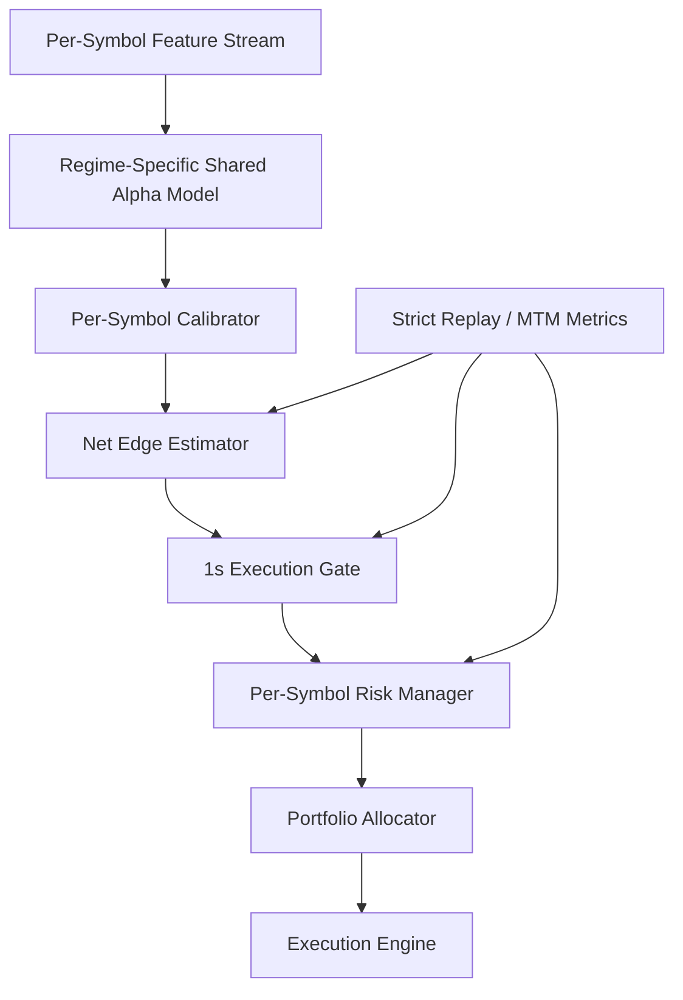

# New_Pro Net-Edge Architecture

## Core Decision

Do not train one universal option model across all symbols as the primary production model.

SPY/QQQ options usually live in a low-IV, tight-spread, high-liquidity regime. Single-stock options often live in a higher-IV, wider-spread, event-driven regime. If both regimes are mixed without guardrails, the model can learn cross-symbol shortcuts that look useful in validation but break in live execution.

The production target for QQQ/SPY should be:

```text
Index ETF regime model
  -> per-symbol calibrator
  -> net edge threshold
  -> 1s execution gate
  -> per-symbol risk manager
```

Full cross-sectional ranking should not be the core alpha for SPY/QQQ.

## Target Pipeline



## Training Regimes

### Regime 1: Index ETF Options

Primary production group:

```text
SPY, QQQ
```

Optional later expansion:

```text
IWM, DIA
```

This group should train together first, because their option market structure is closer:

```text
tighter spread
lower IV
deeper book
less single-name gap/event risk
better mid/near-mid fill probability
```

The model should not rely on cross-sectional rank between SPY and QQQ. It should learn shared index-option microstructure, then make per-symbol net-edge decisions.

### Regime 2: High-Liquidity Single Stocks

Candidate group:

```text
AAPL, MSFT, NVDA, AMD, TSLA, META, AMZN
```

This group should not be mixed into the first QQQ/SPY production model by default. Their IV, event profile, skew, spread, and contract behavior are different enough to contaminate a low-IV index model.

They can have a separate shared model later:

```text
single_stock_shared_model
  -> per-symbol calibrator
  -> per-symbol threshold
```

### Regime 3: BTC Perpetual

BTC perpetual is not an option regime. It should use a separate config/model path:

```text
BTC feature stream
  -> BTC-specific alpha model
  -> funding/liquidity-aware net edge
  -> perp execution gate
```

Do not mix BTC perpetual with equity options.

## Recommended Training Order

### P0: Data and Label Integrity

Before training:

```text
label_return_fwd_gross exists
label_execution_cost exists
label_return_fwd_net exists
label_direction_net exists
net return has non-zero variance
cost distribution is realistic
```

If net labels are mostly zero, the issue is usually one of:

```text
execution cost too high
label horizon too short
price column mismatch
missing bid/ask cost inputs
LMDB silently falling back to old labels
```

### P1: QQQ/SPY Regime Model

Train only the index ETF group:

```text
train symbols: SPY, QQQ
validation: time-split SPY, QQQ
metric: per-symbol net IC, Top5 net return, Top5 hit rate, strict replay PnL
```

This should produce:

```text
checkpoints_index_etf_net_edge/
```

### P2: QQQ-Only Calibration

Freeze most of the shared model and fine-tune:

```text
symbol_calibrator
head_net_edge
head_execution_cost
head_gross_return
fusion top layers
```

This should produce:

```text
checkpoints_qqq_net_edge/
```

### P3: SPY-Only Calibration

Same as QQQ, but separate checkpoint and thresholds:

```text
checkpoints_spy_net_edge/
```

SPY and QQQ should not share the final entry threshold.

### P4: Strict Replay

A model is not valid until it survives:

```text
quote snap fills
spread fraction fill
1s execution delay
MTM drawdown
forced exits
spread/quote-age gate
```

Mid-price validation is not enough.

## Why Not Full-Data Pretrain First?

Full-data pretraining can still be useful only if treated as representation learning, not as the production alpha.

The risk is:

```text
single-stock high IV dominates return labels
wide-spread names teach wrong execution assumptions
event-driven single names create false positive edge
cross-sectional rank rewards symbol identity instead of tradable signal
QQQ/SPY low-IV signals get underweighted
```

So the safer order is:

```text
QQQ/SPY regime model first
single-stock model later
optional broad pretrain only after strict regime controls exist
```

## Production Decision Rule

For QQQ/SPY, use absolute per-symbol net edge:

```text
trade if:
  net_edge > symbol_threshold
  execution_cost < symbol_cost_limit
  spread_pct < symbol_spread_limit
  quote_age <= 1s
  risk manager allows new position
```

Do not trade because QQQ ranks above unrelated high-IV names.

## Metrics That Matter

Model-level:

```text
per-symbol IC
top quantile net return
top quantile hit rate
predicted net_edge calibration curve
execution_cost error
```

Replay-level:

```text
strict PnL
MTM max drawdown
average fill slippage
trade count per day
profit factor
tail loss per trade
cost / gross edge ratio
```

Live dry-run:

```text
signal to quote latency
mid fill probability
bid/ask drift after signal
entry reject rate
exit slippage
drawdown path vs replay
```

