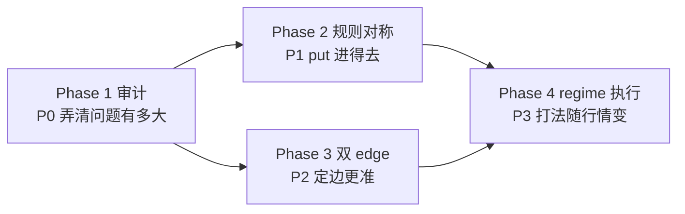

# QQQ 双向交易架构：四 Phase 路线图

## 文档状态

| 项 | 内容 |
|----|------|
| 版本 | v0.1（架构定稿，**尚未开始编码**） |
| 范围 | `New_Pro/baseline_qqq`：QQQ 单标的、0DTE/1DTE、`absolute net_edge` |
| 前置 | [ARCHITECTURE_NET_EDGE.md](../ARCHITECTURE_NET_EDGE.md)、[QQQ_0DTE_PIPELINE.md](./QQQ_0DTE_PIPELINE.md)、`exec_profile` / `multi_band` 滚仓设计 |
| 原则 | **先审计、再规则、再模型、再执行**；每 Phase 有明确「解决 / 不解决」边界 |

---

## 1. 核心判断

### 1.1 业务事实

- 真实市场里 **多数交易日不是单边大阳线**；跌段买 put、涨段买 call 才能覆盖更多可交易分钟。
- 极少数 **V 型 epic**（如错价后 10 倍）是尾部行情，不能作为默认训练与执行假设。
- 当前栈 **已支持** `alpha > 0 → CALL`、`alpha < 0 → PUT`（见 `strategy_core_v0`、`execution_engine_v8.select_direction_split_entry_slots`），但 **规则与案例偏多头、偏短打**，跌日 put 系统性吃亏。

### 1.2 架构目标

```text
跌日系统化做 put + 涨日做 call + 震荡日双边短打
  → 不依赖「每天赌大阳线」
  → 分 Phase 归因：门禁 / 模型定边 / 执行打法
```

### 1.3 非目标（本路线图内不做）

- 恢复 legacy 多标的截面 rank 作为主 alpha。
- 用快通道 TFT/WaveTCN **单独训练方向**（快通道职责见 §4）。
- 在未完成 Phase 1 审计前，大规模改模型结构或重训 LMDB。

---

## 2. 根问题（P0–P3）

| ID | 根问题 | 典型表现 |
|----|--------|----------|
| **P0** | 不知道漏了多少边、错在哪一层 | 跌日该做 put 没做；无法区分「方向错」vs「门禁挡」vs「持有太短」 |
| **P1** | 规则层多头 / 短打偏向 | Ch-A、INDEX_GUARD、dislocation 对 call 更友好；put 对称性不足 |
| **P2** | 模型层单边信号 | 推理主用标量 `net_edge` + 符号分边，无法同刻比较 call/put 哪侧更值 |
| **P3** | 执行层一种打法打全天 | `multi_band` / epic 未按涨日、跌日、震荡切换 hold 与止盈 |

四个 Phase **分别对准 P0 → P1 → P2 → P3**，是递进关系，不是四个可随意调换的独立项目。



---

## 3. 快慢通道职责（架构定稿）

与 Phase 编号无关，**全链路固定分工**：

| 层级 | 时间尺度 | 组件 | 职责 | 属于 Phase |
|------|----------|------|------|------------|
| 慢通道 | 约 30–60min 上下文（1min + 5min LMDB） | `AdvancedAlphaNet` / 慢 TFT | **Regime 输入**、`call_edge` / `put_edge`（Phase 3 后）、5m 可交易性 | 3；为 4 提供 regime |
| 快通道 | 约 10min 窗（1min 特征） | `fast_feature_qqq.json` | **仅门控**：`fast_vol`、`options_vw_spread`、`options_iv_momentum`；**不训练方向** | 2 门控；4 进场时机 |
| 秒级 | 1s fused tick | `_process_fast_fused_tick` | 持仓后高频退出嗅探；**不独立定方向** | 4 退出辅助 |
| 策略规则 | 分钟 | `StrategyCoreV0` | 对称门禁、dislocation、流动性 | 2 |
| 执行 | 持仓期 | `exec_profile` / `multi_band` | band、冷却、epic_upgrade | 4 |

**架构原则**：方向由 **慢通道双 edge（Phase 3）+ 规则对称（Phase 2）** 决定；快通道只回答 **「现在能不能打、要不要等」**。

当前实现差距（文档化，供 Phase 1 验证）：

| 项 | 现状 | 目标 |
|----|------|------|
| 慢通道推理 | `USE_NET_EDGE_ALPHA` → 标量 `net_edge`，`sign` → side | `argmax(call_edge, put_edge)` 且 > 阈值 |
| 慢通道标签 | `d60s_h300s` 单边净收益为主 | 训练对齐 `call_ret` / `put_ret`（parquet 已有） |
| 快通道 | 配置写明不训 WaveTCN，仅 regime gate | 保持；可选加 `entry_timing` 标量，与方向解耦 |
| dislocation | 涨日 V 底 call（`CH_DISLOC`） | 跌日 V 顶 put 对称（Phase 2） |

---

## 4. 日度 Regime 定义（Phase 1 前须拍板）

审计与 Phase 4 共用同一套 **session regime** 分类。v0.1 建议先用 **规则版**（不依赖新模型），便于回放复现：

### 4.1 日型（Day Type）— 开盘至当前或全日

基于 **QQQ 现货**（非期权）：

| 标签 | 条件（示例，Phase 1 可调参） | 主交易侧 |
|------|------------------------------|----------|
| `trend_up` | 09:30→现在 ROC ≥ +0.35% 且 5m ROC 同向 | call 为主 |
| `trend_down` | 09:30→现在 ROC ≤ -0.35% 且 5m ROC 同向 | put 为主 |
| `chop` | \|日内 ROC\| < 0.35% 或 5m 与日内方向不一致 | 双边短打、小仓 |
| `dislocation` | 期权相对标的超涨/超跌 + `snap_roc` 与日内方向背离（V 底/V 顶） | 错价腿；可 epic_upgrade |

### 4.2 分钟内型（Micro Regime）— 单 tick

| 标签 | 用途 |
|------|------|
| `tradable` | 快通道 spread/IV/vol 通过 |
| `blocked` | 不可交易，观望 |
| `timing_ok` | Phase 4 可选：1min `snap_roc` 与已定 side 同向 |

**Phase 1 交付**：每个交易日一条 `day_type` + 分钟级 `tradable` 占比；**不在此阶段实现** Phase 4 路由。

---

## 5. 方向真值与审计口径（Phase 1 契约）

### 5.1 收益列（与现有 audit 对齐）

引用 `utils/audit_alpha_executable_edge.py` 思路，每分钟 / 每信号点：

| 字段 | 含义 |
|------|------|
| `call_ret` | 该时刻买 call、按 `d60s_h300s`（或配置主 horizon）持有的扣费净收益 |
| `put_ret` | 同上，put 侧 |
| `alpha` | 当前实盘使用的 `net_edge`（或回放注入值） |

### 5.2 方向模式（对比用，非实盘策略）

| mode | 定义 | 回答的问题 |
|------|------|------------|
| `normal_alpha_sign` | `alpha ≥ 0` → `call_ret`，否则 `put_ret` | **当前系统** 方向映射好不好 |
| `call_only` | 永远 call | 涨日上限 |
| `put_only` | 永远 put | 跌日上限 |
| `oracle_best_side` | `max(call_ret, put_ret)` | **理论上界**（不可实盘，用于 gap 度量） |
| `inverted_alpha_sign` | `alpha ≥ 0` → `put_ret` | 符号是否反了 |

### 5.3 核心指标（Phase 1 必须产出）

| 指标 | 分母 | 说明 |
|------|------|------|
| `direction_hit_rate` | `normal` 有交易的分钟 | 选对边（与 oracle 同侧）比例 |
| `oracle_gap_bps` | 全日 | `mean(oracle) - mean(normal)` |
| `put_opportunity_share` | `oracle > min_edge` 的分钟 | 跌日 put 占最优侧比例 |
| `gate_block_rate_put` | 跌日、alpha 指向 put | 回放 gate trace 归因挡单率 |
| `capture_vs_oracle_pct` | 分 `day_type` | 正常模式 / oracle 均值比 |

### 5.4 Phase 1 结束须能回答的三句话

1. 跌日里，**put 最优侧**占可交易 edge 的百分之几？
2. 当前 `alpha` 符号在跌日 **选对边比例** 是多少？
3. 若 **只做 Phase 2（规则对称）、不做 Phase 3**，回放上限大约多少？

**决策门**：

- `oracle_gap` 很小 → 优先 Phase 2 + 4，Phase 3 可延后。
- 跌日 put 机会大但 `normal` 常指 call → Phase 2 + 3 并行规划。
- `inverted` 显著优于 `normal` → 先查 label 符号 / `correction_mode`，再谈双头。

---

## 6. 四 Phase 详述

### Phase 1：历史审计 — 解决 P0

| 项 | 内容 |
|----|------|
| **解决** | 量化方向映射、分日型机会、门禁挡单归因；为 Phase 2/3 排优先级 |
| **不解决** | 不改策略、模型、执行；不承诺 PnL 提升 |
| **动什么** | 报告、脚本、现有 `audit_alpha_executable_edge` / 回放 gate trace 汇总 |
| **不动什么** | `strategy_core_v0`、`trading_tft_stock_embed`、LMDB 管线 |
| **依赖** | 历史 alpha parquet + call/put 标签列；可选 S4 1s 回放 gate trace |
| **完成标准** | §5.3 指标表 + §5.4 三句话有数；输出《Phase1 审计摘要》 |

**建议产出物**：

```text
reports/bidirectional_phase1/
  daily_regime.parquet      # date, day_type, qqq_roc_day, ...
  direction_modes.parquet # 分日汇总 normal/call_only/put_only/oracle
  gate_blocks_by_day.csv  # 跌日 put 侧各 gate block 计数
  PHASE1_SUMMARY.md       # 结论与 Phase 2/3 优先级建议
```

---

### Phase 2：规则对称 — 解决 P1

| 项 | 内容 |
|----|------|
| **解决** | put 与 call **同一套逻辑对称**；跌日 put 不再被规则系统性挡在门外 |
| **不解决** | 方向最优（仍 `sign(net_edge)`）；5min 标签 vs 长持；epic 10 倍 |
| **动什么** | `strategy_core_v0` 门禁、`entry_risk_rules` spread cap、`CH_DISLOC` 对称 put 路径、`INDEX_GUARD` 跌日语义 |
| **不动什么** | TFT 权重、LMDB、训练配置；**不在此 Phase 改定边逻辑** |
| **依赖** | Phase 1 指明「挡 put 最多的 gate」 |
| **完成标准** | 跌日 put 可进场分钟 ↑；涨日 call 不显著变差；`normal` 在跌日更接近 `put_only` 的一定比例（阈值 Phase 1 定，建议 ≥60% capture） |

**规则对称清单（实现时逐项勾选）**：

| 模块 | call 现状 | put 对称目标 |
|------|-----------|--------------|
| Ch-A `stock_roc` / `snap` | 多头顺势 | 空头顺势（`dir=-1` 镜像） |
| `CH_DISLOC` | V 底 + 低价 call | V 顶 + 错价 put（`snap` 向下） |
| spread | 低价 call 动态阈值 | put 同价位 band 对齐 |
| `INDEX_GUARD` | 易做成偏多确认 | 跌日确认 put、涨日确认 call |
| `multi_band` `resolve_exec_band` | 已按期权价分档 | 两侧共用价档，方向由 `dir` 决定 |

**Phase 2 / 3 切割（强制）**：

- Phase 2 **只改「能不能进、对称不公平」**。
- **禁止**在 Phase 2 引入 `argmax(call_edge, put_edge)` 或改 alpha 合成公式，避免无法归因。

---

### Phase 3：慢 TFT 双 edge — 解决 P2

| 项 | 内容 |
|----|------|
| **解决** | 同刻比较 call/put 扣费后 edge；震荡日选强侧；训练与 `call_ret`/`put_ret` 对齐 |
| **不解决** | 快通道方向；分钟级 epic 持有（需多 horizon 标签，可 Phase 3b） |
| **动什么** | `AdvancedAlphaNet` 双头、`signal_engine_v8` 推理、`alpha` 注入契约；LMDB 标签权重 |
| **不动什么** | 快通道训练；Phase 4 band 参数（除非审计要求） |
| **依赖** | Phase 1 证明 oracle gap 值得做；Phase 2 已放行 put（否则双头再高也被挡） |
| **完成标准** | 离线 `argmax(call_edge, put_edge)` 稳定优于 `sign(net_edge)`；分 `day_type` 方向命中率提升；oracle gap 缩小 |

**推理契约（Phase 3 后）**：

```text
call_edge, put_edge = slow_model(...)
side = CALL if call_edge > put_edge and call_edge > τ else
       PUT  if put_edge  > call_edge and put_edge  > τ else
       NONE
alpha_for_gates = selected_edge   # 与 StrategyConfig 阈值一致
dir = +1 / -1 from side
```

`head_dir`（3 分类）可作为一致性校验或辅助 loss，**不替代**双 edge 定边。

---

### Phase 4：Regime → 执行 profile — 解决 P3

| 项 | 内容 |
|----|------|
| **解决** | 进对边之后 **拿多久、滚不滚、是否 epic_upgrade**；震荡短打、趋势放宽、错价升级 |
| **不解决** | 定边（Phase 3）；进门禁（Phase 2） |
| **动什么** | `exec_profile` 路由表、`strategy_config0` band 按 regime、`epic_upgrade` 与 TFT 多 horizon（若已有） |
| **依赖** | Phase 1 `day_type`；Phase 3 `side`；Phase 2 对称门禁 |
| **完成标准** | 分 regime 回测：震荡回撤 ↓、趋势 capture ↑；整体不依赖单日 epic |

**Regime → Profile 路由表（v0.1 草案）**：

| day_type | 默认 `EXEC_PROFILE` | 主 side | hold 倾向 |
|----------|---------------------|---------|-----------|
| `trend_up` | `multi_band` 或 `swing_1dte` | call | Band2/3 放宽 trailing |
| `trend_down` | `multi_band` | put | 对称 band |
| `chop` | `scalp_0dte` / tight `multi_band` | 双 edge 强侧 | 短 hold、严 spread |
| `dislocation` | `multi_band` + `epic_upgrade` 候选 | 错价侧 | Band1 可升级 epic |

与现有 `multi_band`（BAND1/2/3）关系：**Phase 4 不替换 band 价档**，只在 regime 层选择 **是否启用滚仓、是否升级 epic、参数松紧**。

---

## 7. 与现有能力的关系

| 已有能力 | 本路线图中的位置 |
|----------|------------------|
| `EXEC_PROFILE=multi_band` | Phase 4 执行内核；Phase 2 保证 put 能进 band |
| `CH_DISLOC` / Band1 | Phase 2 扩展 put 对称；Phase 4 dislocation + epic_upgrade |
| `absolute net_edge` | Phase 3 演进为双 edge，仍不做截面 rank |
| `FAST_GATE_*` | 保持门控；不升格为方向模型 |
| `audit_alpha_executable_edge` | Phase 1 核心工具之一 |
| `replay_live_parity_utils` | Alpha +60s 延迟；审计须与实盘时钟一致 |

---

## 8. 实施顺序与代码冻结

### 8.1 顺序（强制）

```text
1. 本文档评审通过
2. Phase 1：只读审计 + PHASE1_SUMMARY.md
3. 根据摘要开 Phase 2 PR（策略对称，单 PR 可 review）
4. Phase 3 与 LMDB/训练单独立项；上线前 Phase 2 已合并
5. Phase 4 在 2+3 有 baseline 后做 regime 路由
```

### 8.2 编码前检查清单

- [ ] §4 日度 regime 阈值是否认可（或改为纯数据驱动分位数）
- [ ] §5.3 指标与 Phase 1 数据源路径确认（parquet / LMDB / 回放）
- [ ] Phase 2/3 切割（§6 Phase 2）团队共识
- [ ] Phase 1 完成标准与「是否做 Phase 3」决策门（§5.4）共识

### 8.3 显式代码冻结

在 **Phase 1 审计摘要评审通过前**：

- 不合并 Phase 2+ 策略/模型/执行改动（**本文档提交除外**）。
- 不启动 LMDB 重训。
- 可运行 **只读** audit / analyzer 生成报告。

---

## 9. 风险与误区

| 误区 | 说明 |
|------|------|
| 双 edge = 每天 10 倍 | 双 edge 只改善 **选边**；10 倍仍依赖 epic 持有与尾部行情 |
| 快通道训方向 | 与 `fast_feature_qqq.json` 设计冲突；易与慢通道打架 |
| Phase 2 同时改 alpha 公式 | 无法区分门禁收益与模型收益 |
| 忽略 +60s alpha 延迟 | 9:52 V 底审计必须用对齐时钟，否则高估可交易性 |
| 用 epic 日回测论证日常策略 | 日常应以 `trend_*` / `chop` 日占比为主 |

---

## 10. 参考文件

| 路径 | 用途 |
|------|------|
| `New_Pro/ARCHITECTURE_NET_EDGE.md` | 单标的 net_edge、训练 regime |
| `New_Pro/CONFIG/slow_feature.json` | 慢通道标签 `d60s_h300s`、双塔特征 |
| `New_Pro/CONFIG/fast_feature_qqq.json` | 快通道仅门控 |
| `baseline_qqq/utils/audit_alpha_executable_edge.py` | Phase 1 方向模式 |
| `baseline_qqq/exec_profile.py` | Phase 4 执行 profile |
| `baseline_qqq/replay_live_parity_utils.py` | Alpha 时钟、指数 ROC |
| `baseline_qqq/strategy_core_v0.py` | Phase 2 门禁主战场 |
| `baseline_qqq/signal_engine_v8.py` | Phase 3 推理注入 |
| `model/trading_tft_stock_embed.py` | Phase 3 模型结构 |

---

## 11. 修订记录

| 日期 | 版本 | 说明 |
|------|------|------|
| 2026-05-29 | v0.1 | 初稿：四 Phase 边界、快慢通道分工、regime/审计契约、代码冻结 |
