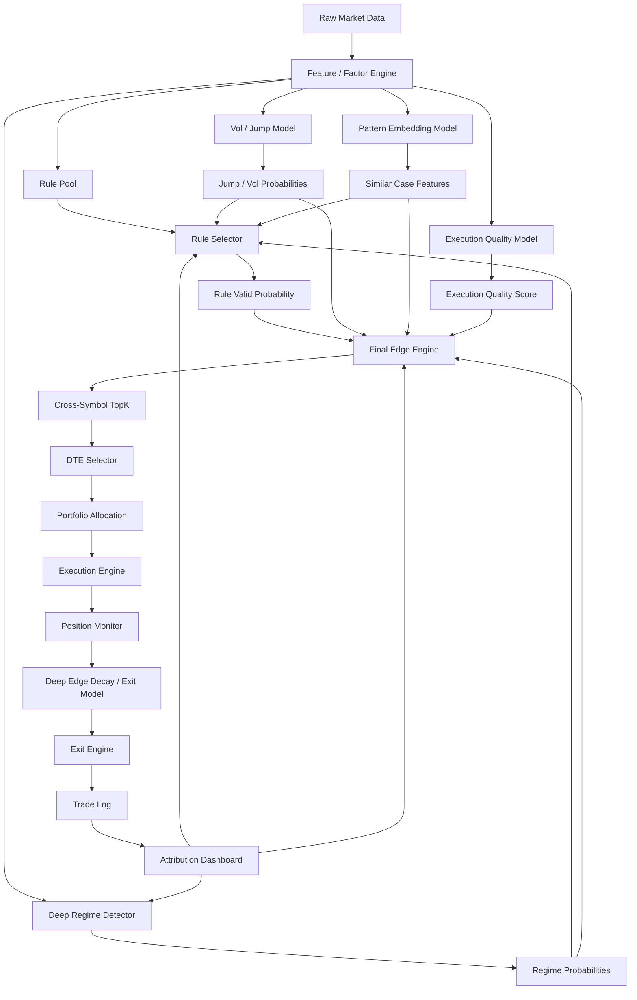
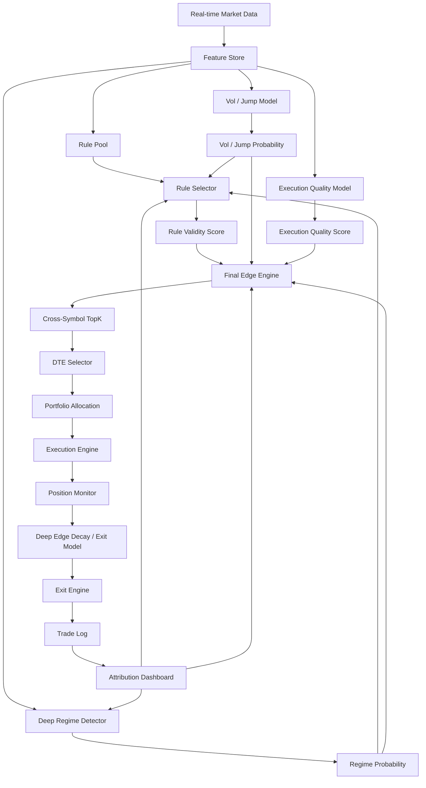

# 基于论文证据的深度学习增强方案：短期期权 Alpha Engine

> 适用范围：QQQ / SPY / MAG7，0DTE / 1DTE / 2DTE  
> 目标：在“规则跨月不稳定、不同月份市场状态不同”的前提下，用深度学习提高系统的收益稳定性、TopK 质量、退出质量和执行质量。  
> 核心结论：**深度学习不应该直接替代规则系统，而应该作为 Regime Detector、Rule Selector、Deep Factor、Execution Filter 和 Exit Model。**

---

## 0. 最重要的结论

目前没有一篇公开论文能直接证明：

```text
QQQ / MAG7 0DTE
+ 规则池
+ 深度学习 Regime Detector
+ Rule Selector
= 一定提高实盘收益
```

但有充分的“组件级证据”支持这条工程路线：

```text
0DTE 受 Gamma / Jump / Vol / Liquidity 强驱动
→ 需要 State / Regime

规则跨月不稳定
→ 需要 Regime-aware Rule Selection

基础规则有局部 Alpha 但 false positive 多
→ 需要 Meta-labeling / Rule Selector

0DTE 实盘收益受 bid/ask、fill、slippage、theta 影响很大
→ 需要 Execution Quality Model

很多交易入场正确但退出差
→ 需要 Edge Decay / Exit Model

深度学习在期权交易、LOB 预测、fill probability 上已有证据
→ 可作为增强模块，而不是直接输出 Buy Call / Buy Put
```

所以最终方向应该是：

```text
Rule Pool 提供可解释 Alpha
Deep Learning 判断当前市场状态、规则有效性、执行质量和退出时机
Edge Engine 负责排序
Risk / Execution 负责保住收益
```

---

## 1. 论文证据与系统模块映射

| 论文 / 研究方向 | 主要结论 | 对系统的启发 |
|---|---|---|
| 0DTE Gamma Risk | 正 / 负 Gamma 会影响日内反转与动量 | 必须建 Gamma State，规则不能全局生效 |
| 0DTE Intraday Jumps | 0DTE 对日内跳变和尾部风险极敏感 | 必须建 Jump / Vol Expansion 因子 |
| 0DTE Trading Rules | 0DTE 规则收益有条件性，尾部风险大 | 不能追求全局规则，要做 Conditional Alpha |
| Regime-aware ML | 市场非平稳，Regime 会改变收益结构 | 需要 Regime Detector |
| Meta-labeling | 二级模型可过滤 false positives、改善 Sharpe / drawdown | Rule Selector 应该叠在规则池上 |
| Deep Learning for Options Trading | 深度学习在期权策略中可能提高风险调整收益 | 可用深度学习生成 Deep Factors / Meta Edge |
| DeepLOB / LOB DL | 深度学习可从订单簿中提取可迁移微观结构特征 | 可用于 Execution / Flow / Liquidity |
| Fill Probability DL | 深度学习可预测限价单成交概率和 fill time | 可用于 Execution Quality Model |
| LOB Forecasting Operational Metrics | 传统预测指标不等于可交易收益 | 验证必须看可执行收益，而不是只看 IC |

---

## 2. 关键论文依据

### 2.1 0DTE Gamma：支持 Gamma State / Momentum vs Reversal

**论文：**  
Chukwuma Dim, Bjorn Eraker, Grigory Vilkov, *0DTEs: Trading, Gamma Risk and Volatility Propagation*  
SSRN: <https://papers.ssrn.com/sol3/papers.cfm?abstract_id=4692190>

论文要点：

```text
1. 研究 S&P 500 0DTE 交易是否会放大指数波动。
2. 做市商净 Gamma 平均为正，并与未来日内波动负相关。
3. 正 Gamma 更容易强化日内反转。
4. 负 Gamma 更容易强化日内动量。
```

对你的系统启发：

```text
Positive Gamma:
    更适合 Reversal / Mean Reversion
    不适合盲目追 Momentum

Negative Gamma:
    更适合 Momentum / Breakout
    趋势更可能延续

Gamma Pin:
    买方期权容易被横盘、spread 和 theta 吃掉
```

落地模块：

```text
Gamma State Engine
Pin Risk Score
Gamma Flip Distance
Strike Gamma Concentration
```

---

### 2.2 0DTE Jump Risk：支持 Jump / Vol Expansion 模型

**论文：**  
M. Božović, *Intraday Jumps and 0DTE Options: Pricing and Hedging Implications*  
SSRN: <https://papers.ssrn.com/sol3/papers.cfm?abstract_id=5223127>

论文要点：

```text
1. 0DTE 期权对突然、极端的日内价格跳变极其敏感。
2. 论文将 diffusion risk、volatility risk 和 jump risk 区分出来。
3. 0DTE 是反映和对冲日内尾部风险的重要工具。
```

对你的系统启发：

```text
0DTE 不是普通方向预测问题。
很多收益来自短时间内的 range expansion / jump / gamma acceleration。
```

落地模块：

```text
open_jump_score
close_jump_score
macro_event_jump_score
vol_expansion_probability
range_expansion_probability
jump_probability
```

---

### 2.3 0DTE Trading Rules：支持 Conditional Alpha 而不是全局规则

**论文：**  
Grigory Vilkov, *0DTE Trading Rules*  
SSRN: <https://papers.ssrn.com/sol3/papers.cfm?abstract_id=4641356>

论文要点：

```text
1. 研究 SPX 0DTE 的日内交易规则。
2. 规则收益高度依赖条件、尾部风险和时机。
3. 0DTE 的交易收益不能简单理解为稳定方向预测。
```

对你的系统启发：

```text
全局 IC / 全局规则不稳定是正常现象。
应该寻找 State 条件下的局部 Alpha。
```

落地模块：

```text
Rule × State × Month Attribution
Conditional IC
Conditional Return
TopK by State
```

---

### 2.4 Regime-aware ML：支持 Regime Detector

**研究：**  
Two Sigma, *A Machine Learning Approach to Regime Modeling*  
Link: <https://www.twosigma.com/articles/a-machine-learning-approach-to-regime-modeling/>

要点：

```text
1. 使用 Gaussian Mixture Model 识别市场 Regime。
2. 强调市场存在不同的持久状态。
3. Regime 建模可用于投资决策和尾部风险管理。
```

**论文：**  
A. Bucci, *Market Regime Detection via Realized Covariances*  
ScienceDirect: <https://www.sciencedirect.com/science/article/abs/pii/S0264999322000785>  
arXiv: <https://arxiv.org/abs/2104.03667>

要点：

```text
1. 市场 regime 对资产定价和组合管理重要。
2. Regime 转换会反映在协方差矩阵中。
3. 可用非线性模型和无监督学习识别 regime。
```

**论文：**  
Yiyao Zhang et al., *RegimeFolio: A Regime Aware ML System for Sectoral Portfolio Optimization in Dynamic Markets*  
arXiv: <https://arxiv.org/abs/2510.14986>

要点：

```text
1. 金融市场非平稳。
2. Regime-aware framework 将波动状态分割、分行业预测和动态配置结合。
3. 作者报告了更高累计收益、更高 Sharpe、更低最大回撤和更高预测准确度。
```

对你的系统启发：

```text
规则跨月不稳定，本质是 regime 变化。
不要找一条跨所有月份都赚钱的规则。
应该先识别当前 regime，再激活对应规则组。
```

落地模块：

```text
Deep Regime Detector
Regime Probability
Rule Activation by Regime
Regime-aware Position Sizing
```

---

### 2.5 Meta-labeling：支持 Rule Selector

**研究：**  
Hudson & Thames, *Does Meta Labeling Add to Signal Efficacy?*  
Link: <https://hudsonthames.org/does-meta-labeling-add-to-signal-efficacy-triple-barrier-method/>  
PDF: <https://hudsonthames.org/wp-content/uploads/2022/04/Does-Meta-Labeling-Add-to-Signal-Efficacy.pdf>

要点：

```text
1. Meta-labeling 是叠在 primary signal 上方的二级 ML 层。
2. 它帮助过滤 false positives、改善 Sharpe 和最大回撤。
3. 与 triple-barrier labeling 结合，能让标签更贴近交易结果。
```

对你的系统启发：

```text
你的规则池就是 primary signal。
深度学习 / 机器学习应该做 secondary model：
    当前这条规则是否值得执行？
```

落地模块：

```text
Rule Selector
P(rule works now)
Tradeable Edge Label
Triple Barrier / MAE-MFE Label
```

---

### 2.6 深度学习期权交易：支持 Deep Factor / Meta Edge

**论文：**  
Wee Ling Tan, Stephen Roberts, Stefan Zohren, *Deep Learning for Options Trading: An End-To-End Approach*  
arXiv: <https://arxiv.org/abs/2407.21791>

论文要点：

```text
1. 使用数据驱动深度学习方法学习期权交易信号。
2. 回测覆盖超过十年的 S&P 100 个股期权。
3. 作者报告深度学习模型相对规则策略有更好的风险调整表现。
4. Turnover regularization 在高交易成本场景下有帮助。
```

对你的系统启发：

```text
深度学习在期权交易中不是完全不可用。
但你的 0DTE 场景更极端，不应直接照搬 end-to-end buy/sell。
更稳妥做法是让深度学习输出 Deep Factors 或 Meta Edge。
```

落地模块：

```text
DeepFactor_TrendPersistence
DeepFactor_ReversalProbability
DeepFactor_BreakoutProbability
DeepFactor_VolExpansion
MetaEdgeModel
```

---

### 2.7 DeepLOB / LOB 深度学习：支持 Execution / Liquidity / Flow 模型

**论文：**  
Zhang, Zohren, Roberts, *DeepLOB: Deep Convolutional Neural Networks for Limit Order Books*  
arXiv: <https://arxiv.org/abs/1808.03668>

论文要点：

```text
1. 使用 CNN 捕捉 order book 空间结构。
2. 使用 LSTM 捕捉时间依赖。
3. 在 LOB benchmark 和伦敦证券交易所真实报价数据上表现稳定。
4. 作者强调模型能提取可迁移到未训练 instrument 的通用特征。
```

对你的系统启发：

```text
深度学习适合从微观结构中提取特征。
对于 0DTE，执行和流动性质量直接影响最终 PnL。
```

落地模块：

```text
Execution Quality Model
Liquidity Deep Factor
Flow Pattern Embedding
Spread Widening Probability
```

---

### 2.8 Fill Probability：支持限价单成交质量模型

**论文：**  
Alvaro Arroyo, Alvaro Cartea, Fernando Moreno-Pino, Stefan Zohren,  
*Deep Attentive Survival Analysis in Limit Order Books: Estimating Fill Probabilities with Convolutional-Transformers*  
arXiv: <https://arxiv.org/abs/2306.05479>

论文要点：

```text
1. 限价单成交概率是选择 passive / aggressive execution 的关键。
2. 作者用 convolutional-Transformer + survival analysis 预测 fill time。
3. 模型显著优于传统 survival analysis 方法。
```

对你的系统启发：

```text
0DTE 交易中，能否成交、以什么价格成交、退出时是否滑点，是收益核心。
Execution Model 可能比 Direction Model 更重要。
```

落地模块：

```text
limit_order_fill_probability
expected_fill_time
expected_slippage
exit_liquidity_risk
order_type_decision
```

---

### 2.9 Deep LOB Forecasting：支持“不要只看预测指标，要看可交易性”

**论文：**  
Antonio Briola, Silvia Bartolucci, Tomaso Aste, *Deep Limit Order Book Forecasting*  
arXiv: <https://arxiv.org/abs/2403.09267>

论文要点：

```text
1. 深度学习在 LOB mid-price 预测中有能力。
2. 但高预测能力不一定等于可交易信号。
3. 作者强调需要用更贴近交易可执行性的 operational framework 评估模型。
```

对你的系统启发：

```text
不能只看 IC / accuracy。
必须看：
    bid/ask 可执行收益
    slippage-adjusted PnL
    fill probability
    MFE Capture Ratio
    drawdown
```

落地模块：

```text
Operational Backtest
Entry Ask / Exit Bid
1-bar Delay
Execution-adjusted Metrics
```

---

## 3. 深度学习应该提升哪些环节

深度学习最适合提升以下 7 个模块：

```text
1. Regime Detection
2. Rule Selection
3. Pattern Embedding / Similar Case Search
4. Flow Classification
5. Vol / Jump Forecast
6. Execution Quality Model
7. Edge Decay / Exit Model
```

不建议优先做：

```text
Deep Model → Buy Call / Buy Put
```

---

## 4. 推荐系统架构



---

## 5. 模块一：Deep Regime Detector

### 5.1 目标

识别当前市场属于哪类状态：

```text
P(momentum_regime)
P(reversal_regime)
P(breakout_regime)
P(chop_regime)
P(gamma_pin_regime)
P(vol_expansion_regime)
P(vol_compression_regime)
```

### 5.2 输入

过去 30 - 120 分钟序列：

```text
stock_return
price_vs_vwap
vwap_slope
volume_ratio
realized_vol
atr_expansion
call_delta_flow
put_delta_flow
net_option_delta_flow
iv_change
spread_pct
gamma_proxy
pin_risk_score
relative_strength
time_bucket
```

### 5.3 模型选择

推荐顺序：

```text
第一版：
    LightGBM / CatBoost

第二版：
    TCN / GRU / LSTM

第三版：
    Transformer Encoder

第四版：
    Autoencoder + Clustering / Contrastive Learning
```

### 5.4 标签

先用弱监督标签：

```text
momentum_regime:
    trend persistence 高
    vwap slope 同向
    flow continuation 强
    negative gamma 高

reversal_regime:
    price extended
    flow exhaustion
    index recovery
    positive gamma
    vwap distance 过大

breakout_regime:
    opening range break
    volume expansion
    IV expansion
    relative strength top

chop_regime:
    low range
    poor follow-through
    high pin risk
    low realized volatility
```

---

## 6. 模块二：Rule Selector

### 6.1 目标

解决：

```text
规则跨月不稳定
不知道当前该启用哪条规则
```

输出：

```text
P(rule_i works now)
```

例如：

```text
Momentum Rule: 0.22
Reversal Rule: 0.81
Breakout Rule: 0.35
VWAP Reclaim Rule: 0.74
No Trade: 0.70
```

### 6.2 输入

```text
Rule ID
Current State
Regime Probability
TrendScore
FlowScore
GammaScore
VolScore
LiquidityScore
TimeScore
RelativeStrengthScore
SymbolProfile
DTEProfile
```

### 6.3 标签

不要用未来涨跌。

使用交易型标签：

```python
label_rule_valid = 1 if (
    rule_triggered
    and future_option_bid_ask_return > threshold
    and max_adverse_excursion < max_mae
    and spread_not_worsened
) else 0
```

建议阈值：

```text
0DTE:
    future horizon: 5 - 15 min
    profit threshold: +8% to +20% executable return
    MAE threshold: -8% to -15%

1DTE:
    future horizon: 15 - 60 min
    profit threshold: +10% to +30%
    MAE threshold: -12% to -25%

2DTE:
    future horizon: 30 - 120 min
    profit threshold: +15% to +40%
    MAE threshold: -15% to -30%
```

---

## 7. 模块三：Pattern Embedding / Similar Case Search

### 7.1 目标

让深度模型回答：

```text
当前这段行情，历史上更像哪类走势？
类似片段之后的期权收益、回撤、MFE 是怎样的？
```

### 7.2 结构

```text
过去 60 分钟行情序列
        ↓
Sequence Encoder
        ↓
market_pattern_embedding
        ↓
历史相似片段检索
        ↓
similar_case_features
```

### 7.3 输出

```text
similar_case_avg_return
similar_case_win_rate
similar_case_max_drawdown
similar_case_mfe
similar_case_mae
similar_case_mode
similar_case_state
```

适合增强：

```text
Reversal Mode
Breakout Mode
Opening Drive
Power Hour Gamma
Vol Expansion
```

---

## 8. 模块四：Flow Classification

### 8.1 目标

不再只用简单 PCR，而是识别期权 flow 的性质：

```text
directional_call_flow
directional_put_flow
hedge_flow
spread_flow
noise_flow
flow_continuation
flow_exhaustion
```

### 8.2 输入

```text
strike
expiry
delta
gamma
volume
open_interest
bid_ask_location
trade_direction_estimate
iv_change
underlying_move
time_bucket
spread_pct
```

### 8.3 输出

```text
flow_intent_directional
flow_intent_hedge
flow_intent_spread
flow_intent_noise
flow_aggressiveness
flow_continuation_probability
flow_exhaustion_probability
```

---

## 9. 模块五：Vol / Jump Forecast

### 9.1 目标

预测未来 5 - 15 分钟是否扩波 / 跳变：

```text
P(next_5m_realized_vol_expansion)
P(next_10m_range_expansion)
P(next_15m_jump_move)
P(iv_expansion)
P(vol_compression)
```

### 9.2 用途

```text
1. 判断是否适合买方期权
2. 判断是否选择 0DTE / 1DTE / 2DTE
3. 判断是否启用 Momentum / Breakout
4. 过滤低波横盘买方信号
```

### 9.3 输出因子

```text
jump_probability
vol_expansion_probability
range_expansion_probability
iv_expansion_probability
compression_risk
```

---

## 10. 模块六：Execution Quality Model

### 10.1 目标

预测当前合约是否值得执行：

```text
limit_order_fill_probability
expected_fill_time
expected_slippage
spread_widening_probability
exit_liquidity_risk
quote_stability_score
```

### 10.2 输入

```text
bid_ask_spread
spread_pct
quote_depth
option_volume
quote_update_frequency
time_of_day
contract_delta
DTE
symbol
recent_trade_count
market_volatility
```

### 10.3 使用方式

```text
如果 ExecutionQualityScore 太低：
    即使 Edge 很高，也不交易。
```

这能减少：

```text
看起来方向对
但实盘因为 spread / slippage 赚不到钱
```

---

## 11. 模块七：Edge Decay / Exit Model

### 11.1 目标

判断入场后 Edge 是否还存在。

输出：

```text
P(edge_continues)
P(edge_decays)
P(exit_now)
P(reduce_position)
```

### 11.2 输入

```text
entry_edge
current_edge
holding_time
option_return
MFE
MAE
flow_change
iv_change
spread_change
state_transition
vwap_change
gamma_change
distance_to_pin_strike
```

### 11.3 标签

```python
label_exit_now = 1 if (
    return_if_exit_now > expected_return_if_hold
    or future_edge_decay_large
    or future_drawdown_exceeds_threshold
) else 0
```

### 11.4 价值

很多 0DTE 交易问题不是入场，而是：

```text
最大浮盈 +80%
最后只赚 +15%
甚至亏损
```

Exit Model 的目标是提高：

```text
MFE Capture Ratio
```

---

## 12. Final Edge 公式

深度学习输出不直接下单，而是参与 FinalEdge。

```text
FinalEdge =
BaseRuleEdge
× RegimeProbability
× RuleValidityProbability
× VolJumpScore
× ExecutionQualityScore
× DTEFitScore
× CorrelationPenalty
× DrawdownControl
```

示例：

```text
BaseRuleEdge = 0.82
RegimeProbability = 0.78
RuleValidityProbability = 0.74
VolJumpScore = 0.88
ExecutionQualityScore = 0.90
DTEFitScore = 0.85
CorrelationPenalty = 0.80
DrawdownControl = 0.95

FinalEdge ≈ 0.28
```

如果阈值是：

```text
FinalEdge > 0.35
```

这笔交易就不做。

这说明：

```text
深度学习不是制造黑箱信号，
而是防止规则在错误 Regime、错误 DTE、错误执行环境下被激活。
```

---

## 13. 验证深度学习是否真的提升收益

不能只看：

```text
IC
Accuracy
AUC
```

必须看交易指标：

```text
1. TopK net return 是否提高
2. positive month ratio 是否提高
3. max drawdown 是否下降
4. trade count 是否减少但质量提高
5. MFE Capture Ratio 是否提高
6. slippage-adjusted PnL 是否提高
7. Rule × State × Month 稳定性是否提高
8. bid/ask + 1-bar delay 后是否仍然有效
```

尤其是：

```text
加入模型后，是否减少错误 State 下的交易？
```

如果只是 IC 提高，但可执行收益没有提高，则模型没有实盘价值。

---

## 14. Walk-forward 验证框架

### 14.1 数据切分

不要随机切分。

使用：

```text
Train:
    过去 N 个月

Validation:
    下一个月

Test:
    再下一个月

Walk-forward:
    每月向前滚动
```

### 14.2 对比实验

必须对比：

```text
Baseline A:
    纯规则

Baseline B:
    规则 + State Gate

Model C:
    规则 + State Gate + Rule Selector

Model D:
    规则 + State Gate + Rule Selector + Execution Model

Model E:
    规则 + State Gate + Rule Selector + Execution Model + Exit Model
```

### 14.3 判断标准

只有当：

```text
Model C/D/E
在 OOS 下：
    TopK net return 提高
    positive month ratio 提高
    max drawdown 下降
    trade count 下降但 average trade quality 提高
```

才说明深度学习真正有价值。

---

## 15. 推荐落地顺序

### Step 1：保留现有规则池

不要推翻已经发现的规则。

```text
现有规则 = Primary Signals
```

---

### Step 2：建立 Rule Performance Table

维度：

```text
Rule × State × Month × Symbol × DTE × TimeBucket
```

指标：

```text
Return
Win Rate
Sharpe
Max Drawdown
MFE
MAE
MFE Capture
Positive Month Ratio
```

---

### Step 3：训练轻量 Rule Selector

第一版用：

```text
LightGBM / CatBoost
```

输入：

```text
RuleID + State + Factors + SymbolProfile + DTEProfile
```

输出：

```text
P(rule works now)
```

---

### Step 4：训练 Deep Regime Detector

第二阶段再使用：

```text
TCN / GRU / LSTM / Transformer Encoder
```

输入过去 60 分钟序列，输出：

```text
Regime probabilities
```

---

### Step 5：加入 Execution Quality Model

先过滤掉：

```text
spread 过宽
成交概率低
退出流动性差
quote 不稳定
```

---

### Step 6：加入 Edge Decay / Exit Model

目标：

```text
提高 MFE Capture Ratio
降低回撤
减少 Edge 衰减后的持仓
```

---

### Step 7：加入 Pattern Embedding

最后再加入：

```text
similar historical cases
sequence embedding
contrastive learning
```

用于增强 Reversal / Breakout / Power Hour 这类复杂结构。

---

## 16. MVP 版本

第一版可以非常简单。

### 16.1 Universe

```text
QQQ
NVDA
TSLA
```

### 16.2 DTE

```text
0DTE only
```

### 16.3 模型

```text
LightGBM Rule Selector
```

### 16.4 输入

```text
RuleID
State
Symbol
DTE
TimeBucket
TrendScore
FlowScore
GammaScore
VolScore
LiquidityScore
RelativeStrengthScore
```

### 16.5 输出

```text
P(rule works now)
```

### 16.6 评估

对比：

```text
纯规则
vs
规则 + Rule Selector
```

核心指标：

```text
TopK net return
positive month ratio
max drawdown
MFE Capture Ratio
slippage-adjusted PnL
trade count
```

---

## 17. 风险与注意事项

### 17.1 过拟合风险

如果模型只是在学习：

```text
某个月的特殊行情
```

而不是学习：

```text
可迁移的 Regime
```

那 OOS 会失效。

解决：

```text
walk-forward
purged CV
embargo
按月份 / regime / symbol 做分组验证
```

---

### 17.2 标签泄漏

必须避免：

```text
未来 bid/ask 信息泄漏
未来 IV / Greeks 泄漏
未延迟的 option quote 泄漏
```

所有特征必须满足：

```text
signal_time 可观测
entry_time 可执行
至少 1-bar delay
```

---

### 17.3 交易成本低估

0DTE 的回测必须用：

```text
entry ask
exit bid
spread filter
slippage model
commission
fill probability
```

否则结果会严重虚高。

---

### 17.4 指标误导

不要只看：

```text
IC / AUC / Accuracy
```

真正重要的是：

```text
可执行收益
回撤
MFE 捕获率
TopK 排序质量
跨月稳定性
```

---

## 18. 最终生产形态



---

## 19. 最核心的工程判断

你的系统现在遇到的是：

```text
规则跨期不稳定
每个月状态不一样
```

这不代表规则无效，而是说明：

```text
规则必须被 Regime 条件化。
```

深度学习最适合做的不是：

```text
直接预测买 Call / Put
```

而是：

```text
识别当前 Regime
判断哪条规则现在有效
过滤执行质量差的交易
判断 Edge 是否衰减
帮助提高 TopK 排序质量
```

最终目标不是让交易次数更多，而是：

```text
交易次数更少
错误 State 更少
TopK 更准
退出更及时
MFE 捕获率更高
跨月稳定性更好
```

---

## 20. 最终一句话

> 结合论文证据，深度学习最有价值的位置不是“方向预测主模型”，而是“Regime-aware Rule Selector + Execution / Exit Enhancer”。它的作用是让规则池从固定规则系统升级为状态自适应系统，从而减少错误交易、提高 TopK 质量、改善退出和执行，最终提升收益稳定性。

