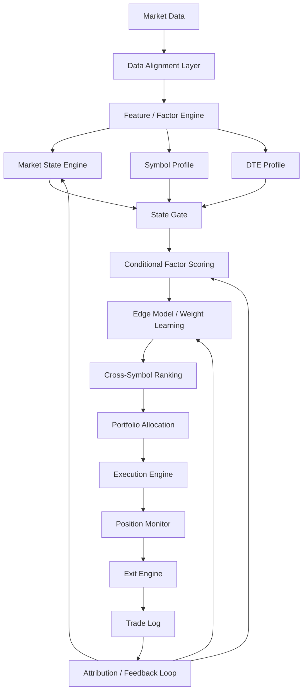
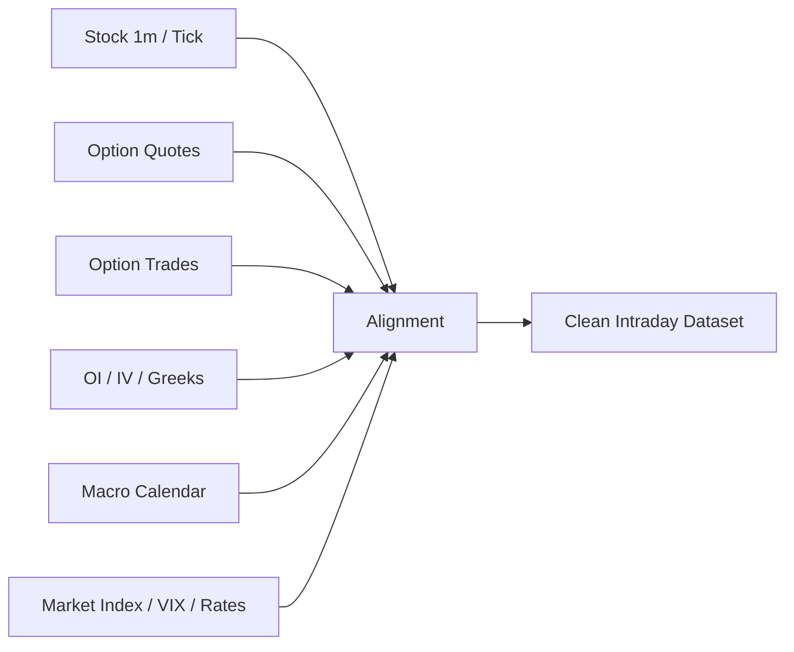
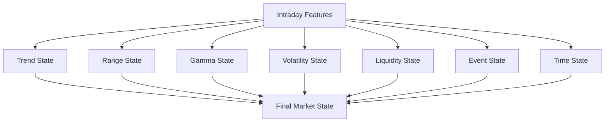
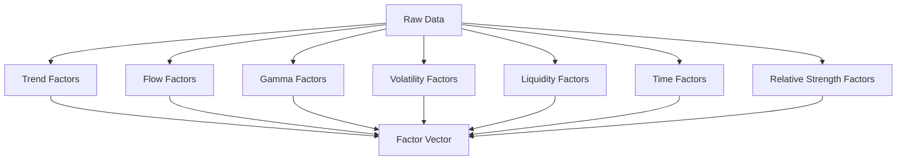
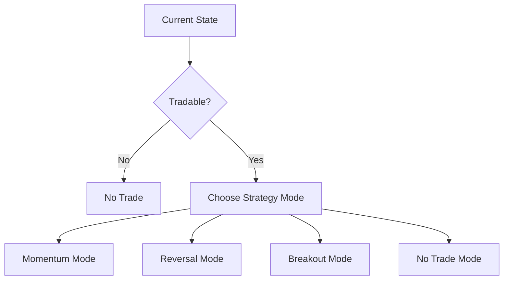
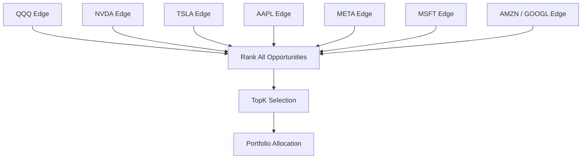
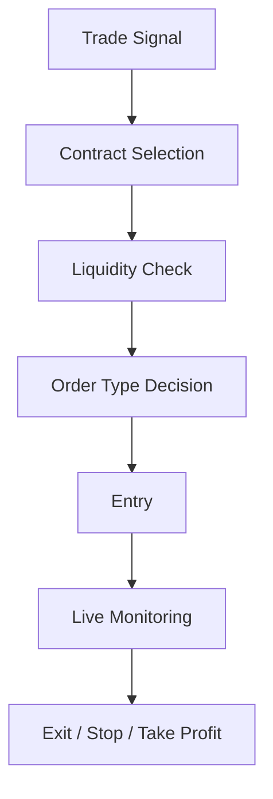
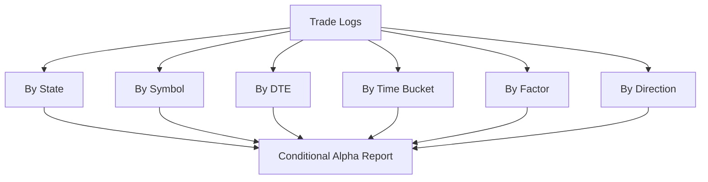
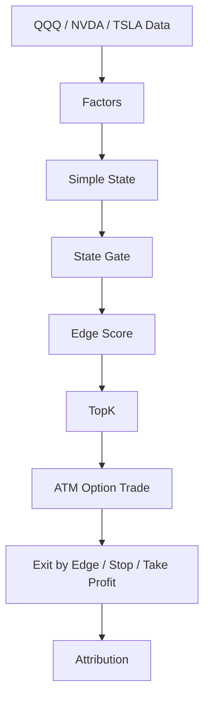
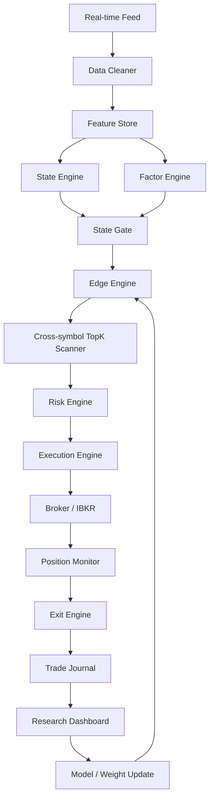

# 跨标的短期期权日内 Alpha Engine 架构文档

> 适用范围：QQQ / SPY / MAG7，0DTE / 1DTE / 2DTE  
> 核心思想：不是预测涨跌，而是识别 **某个标的在某个 DTE、某个 State 下是否存在可执行 Edge**。

---

## 0. 总结

这套系统不应该被设计成“QQQ 0DTE 专用策略”，而应该设计成：

```text
跨标的短期期权日内 Alpha Engine
```

核心流程：

```text
Market Data
    ↓
State Engine
    ↓
Factor Engine
    ↓
Edge Scoring
    ↓
Cross-Symbol Ranking
    ↓
Portfolio Allocation
    ↓
Execution
    ↓
Position Monitor / Exit
    ↓
Attribution / Feedback Loop
```

一句话：

> 你交易的不是 QQQ，也不是 TSLA；你交易的是某个标的在某个 DTE、某个市场状态下出现的可执行优势。

---

## 1. 总体架构图



---

## 2. 为什么不用深度学习直接预测方向

旧结构：

```text
K线 + 期权特征
        ↓
TFT / Transformer
        ↓
预测未来上涨概率
        ↓
买 Call / Put
```

问题：

1. 0DTE 价格受 Gamma、Dealer Hedging、订单流、流动性、Theta、Jump Risk 影响很大。
2. 深度模型容易学到历史形态，而不是当下真实驱动。
3. 全局 IC 可能不高，但某些 State 下存在显著局部 Alpha。
4. 实盘中延迟、滑点、spread、bid/ask 可执行性会显著侵蚀回测表现。

新结构：

```text
实时市场数据
        ↓
判断 State
        ↓
只在有效 State 中计算 Edge
        ↓
跨标的、跨 DTE 排序
        ↓
只交易 TopK 高 Edge 机会
```

核心原则：

```text
State First
Factor Second
Model Third
Execution Last
```

---

## 3. Data Layer：数据层



### 3.1 数据输入

```text
1. 标的价格：
   QQQ / SPY / NVDA / TSLA / AAPL / MSFT / META / AMZN / GOOGL

2. 期权报价：
   bid / ask / mid / spread

3. 期权成交：
   volume / trade price / estimated trade direction

4. Greeks：
   delta / gamma / theta / vega

5. IV：
   ATM IV / skew / term structure

6. OI：
   strike-level open interest

7. 市场数据：
   VIX / QQQ / SPY / sector ETF / rates proxy

8. 事件数据：
   CPI / FOMC / 非农 / 财报 / 产品发布 / 盘中新闻
```

### 3.2 回测数据要求

必须满足：

```text
1. 不能用 last trade 做可执行价格。
2. 入场至少用 ask 或 ask/mid 压力测试。
3. 出场至少用 bid 或 bid/mid 压力测试。
4. 所有信号至少使用 1-bar delay。
5. 期权分钟数据需要和股票分钟数据严格对齐。
6. 必须过滤 spread 过宽、volume 不足、quote 不稳定的合约。
```

最低可执行回测标准：

```text
Entry = Ask
Exit = Bid
Signal Delay = 1 bar
Spread Filter = spread_pct < threshold
Liquidity Filter = volume / quote_depth enough
```

---

## 4. State Engine：市场状态识别层

State Engine 是整套系统最重要的一层。



### 4.1 基础 State

至少需要识别：

```text
1. Trend Up
2. Trend Down
3. Range / Chop
4. Gamma Pin
5. Vol Expansion
6. Vol Compression
7. Opening Drive
8. Midday Decay
9. Power Hour
10. Event / News State
```

### 4.2 推荐 State 表达

```python
state = {
    "trend_direction": "up / down / flat",
    "trend_strength": "weak / medium / strong",
    "gamma_regime": "positive / negative / neutral",
    "volatility_regime": "expansion / compression / normal",
    "liquidity_regime": "good / poor",
    "time_bucket": "open / mid_day / power_hour",
    "event_risk": "normal / high"
}
```

### 4.3 关键判断

```text
Positive Gamma:
    更容易反转 / 压波 / Gamma Pin

Negative Gamma:
    更容易趋势延续 / 波动放大

Vol Expansion:
    适合 Momentum / Breakout，但需要严格止损

Vol Compression:
    买方期权容易被 theta 和 IV crush 吃掉

Opening Drive:
    可能是全天趋势的起点，也可能是假突破

Power Hour:
    可能出现 Gamma 加速、Pin、强制对冲和跳变
```

---

## 5. Factor Engine：因子层



---

### 5.1 Trend Factors

```text
price_vs_vwap
vwap_slope
ema_alignment
opening_range_break
higher_high_count
lower_low_count
trend_persistence
pullback_quality
```

作用：

```text
判断是否是真趋势，而不是假突破。
```

---

### 5.2 Flow Factors

```text
call_delta_flow
put_delta_flow
net_option_delta_flow
call_volume_acceleration
put_volume_acceleration
large_trade_ratio
aggressive_buy_ratio
flow_continuation_score
flow_exhaustion_score
```

作用：

```text
判断推动价格的资金流是否仍然存在。
```

---

### 5.3 Gamma / Dealer Factors

```text
atm_gamma
strike_gamma_concentration
gamma_flip_distance
oi_nearby_strikes
dealer_gamma_proxy
pin_risk_score
```

作用：

```text
判断市场更容易动量延续，还是均值回复。
```

经验逻辑：

```text
Negative Gamma → 更容易趋势延续
Positive Gamma → 更容易反转 / 横盘
High Pin Risk → 避免追涨杀跌
```

---

### 5.4 Volatility Factors

```text
realized_vol_5m
realized_vol_15m
iv_change
iv_vs_rv
atr_expansion
jump_score
expected_move_usage
open_jump_score
close_jump_score
macro_event_jump_score
```

作用：

```text
判断今天是扩波行情，还是期权买方容易被时间价值吃掉。
```

---

### 5.5 Liquidity Factors

```text
bid_ask_spread
spread_pct
quote_depth
option_volume
quote_stability
slippage_estimate
```

作用：

```text
控制是否可交易。
```

对于 0DTE，Liquidity Filter 极其关键。信号再强，如果 spread 扩大，也不能追。

---

### 5.6 Time Factors

```text
minutes_from_open
minutes_to_close
time_bucket
theta_acceleration
lunch_decay_score
power_hour_score
```

0DTE 每个时间段都不是同一个市场：

```text
09:30 - 10:00：Opening Jump / Opening Drive
10:00 - 11:30：Trend Confirmation
11:30 - 14:00：Decay / Chop
14:00 - 15:30：Repricing
15:30 - 16:00：Power Hour / Gamma / Pin
```

---

### 5.7 Relative Strength Factors

```text
symbol_vs_qqq
symbol_vs_spy
symbol_vs_sector
relative_volume
relative_momentum
cross_sectional_rank
```

作用：

```text
判断今天到底该做 QQQ，还是 NVDA / TSLA / META。
```

---

## 6. State Gate：交易许可层

不是所有时候都要交易。



### 6.1 示例规则

```text
Trend Up + Negative Gamma + Good Liquidity
→ 允许 Call Momentum

Trend Down + Oversold + Positive Gamma
→ 允许 Call Reversal，但仓位降低

Range + Gamma Pin + Low Vol
→ 不交易 0DTE 买方

Event High Risk + Spread Wide
→ 不交易

Power Hour + Vol Expansion + Flow Confirmed
→ 允许高 Edge 短持仓
```

### 6.2 交易模式

#### Momentum Mode

适合：

```text
Trend Up / Trend Down
Negative Gamma
Flow continuing
Vol expansion
Liquidity good
```

目标：

```text
顺势追 Call / Put，持仓略长，吃趋势延续。
```

#### Reversal Mode

适合：

```text
Stock trend down
但下跌衰竭
Put flow 减弱
QQQ/SPY 开始修复
价格远离 VWAP
Gamma / Pin 支持反弹
```

目标：

```text
做超跌反弹或均值回复。
```

#### Breakout Mode

适合：

```text
Opening range break
Volume expansion
IV expansion
Relative strength rank top
```

目标：

```text
突破确认后进入，失败立即退出。
```

---

## 7. Edge Scoring：条件打分层

不要计算一个全局 Edge。

应该计算：

```text
Edge(symbol, dte, state, direction)
```

例如：

```text
Edge(QQQ, 0DTE, TrendUp_NegGamma, Call)
Edge(TSLA, 1DTE, TrendDown_Reversal, Call)
Edge(NVDA, 2DTE, VolExpansion, Put)
```

### 7.1 基础公式

```text
Edge =
  w1 * TrendScore
+ w2 * FlowScore
+ w3 * GammaScore
+ w4 * VolScore
+ w5 * LiquidityScore
+ w6 * TimeScore
+ w7 * RelativeStrengthScore
```

重点：

```text
不同 State 使用不同权重。
```

示例：

```text
Trend State:
    TrendScore 权重大
    FlowScore 权重大
    GammaScore 中等

Range State:
    GammaScore 权重大
    MeanReversionScore 权重大
    TrendScore 降低

Vol Expansion:
    VolScore 权重大
    JumpScore 权重大
    LiquidityScore 权重大
```

---

## 8. Edge Model：轻量模型层

这里可以训练，但不是训练大型深度学习模型。

推荐模型：

```text
LightGBM
XGBoost
CatBoost
Logistic Regression
Online Ridge
IC-weighted ensemble
```

输入：

```text
State + Factors + SymbolProfile + DTEProfile
```

输出：

```text
future_tradeable_edge
```

### 8.1 标签设计

不要简单预测 stock up/down。

更好的标签是：

```text
未来 5~15 分钟：
1. option_return 是否 > X%
2. max_drawdown 是否 < Y%
3. return / drawdown 是否足够高
4. bid/ask 可执行收益是否为正
```

示例：

```python
label = 1 if (
    future_mid_return > 0.20
    and max_adverse_excursion < 0.10
    and exit_bid_return > 0.08
) else 0
```

这种标签比预测未来涨跌更接近真实交易。

---

## 9. Cross-Symbol Ranking：跨标的排序层

这是后期提高收益的关键。



每分钟输出：

```text
Rank 1: NVDA 0DTE Call Edge 0.91
Rank 2: TSLA 1DTE Call Edge 0.86
Rank 3: QQQ 0DTE Call Edge 0.78
Rank 4: META 2DTE Put Edge 0.62
```

只交易：

```text
Top1 / Top3 / Top5
```

核心思想：

```text
不要问 QQQ 现在能不能做。
要问当前整个 Universe 里，哪个标的、哪个 DTE、哪个方向的 Edge 最大。
```

---

## 10. Portfolio Allocation：资金分配层

仓位不能简单平均分配。

建议：

```text
position_size =
base_size
* edge_strength
* liquidity_score
* state_confidence
* correlation_penalty
* dte_risk_penalty
* drawdown_control
```

### 10.1 示例

```text
NVDA Edge 0.92，Liquidity 好，State 强
→ 35% 可用风险预算

TSLA Edge 0.85，但波动极高
→ 25% 可用风险预算

QQQ Edge 0.78，稳定但弹性较低
→ 20% 可用风险预算

META Edge 0.62
→ 不交易或小仓
```

### 10.2 相关性惩罚

多个 MAG7 同时做 Call，本质上可能都是 Nasdaq beta。

因此需要：

```text
correlation_penalty
```

否则你以为在分散，实际是在重复押同一个方向。

---

## 11. DTE Profile：0DTE / 1DTE / 2DTE 参数层

框架共用，但 DTE 必须独立 Profile。

### 11.1 0DTE Profile

```python
DTEProfile_0DTE = {
    "dte": 0,
    "target_delta": "0.45 - 0.60",
    "max_hold_minutes": "5 - 30",
    "stop_loss": "8% - 15%",
    "take_profit": "20% - 60%",
    "gamma_weight": "high",
    "theta_penalty": "very_high",
    "liquidity_requirement": "very_high",
    "overnight_allowed": False
}
```

特点：

```text
Gamma / Liquidity / Time decay 驱动。
最暴利，但最脆。
```

### 11.2 1DTE Profile

```python
DTEProfile_1DTE = {
    "dte": 1,
    "target_delta": "0.40 - 0.60",
    "max_hold_minutes": "15 - 90",
    "stop_loss": "12% - 25%",
    "take_profit": "25% - 80%",
    "gamma_weight": "medium_high",
    "theta_penalty": "high",
    "liquidity_requirement": "high",
    "overnight_allowed": "usually_no"
}
```

特点：

```text
Gamma + Direction + IV 驱动。
比 0DTE 稳定，仍然有弹性。
```

### 11.3 2DTE Profile

```python
DTEProfile_2DTE = {
    "dte": 2,
    "target_delta": "0.35 - 0.55",
    "max_hold_minutes": "30 - 180",
    "stop_loss": "15% - 30%",
    "take_profit": "30% - 100%",
    "gamma_weight": "medium",
    "theta_penalty": "medium",
    "liquidity_requirement": "medium_high",
    "overnight_allowed": "optional_but_risky"
}
```

特点：

```text
Direction + IV + Event expectation 驱动。
容错更高，但资金效率低于 0DTE。
```

### 11.4 动态 DTE 选择

最终不应该只是：

```text
0DTE 参数 A
1DTE 参数 B
2DTE 参数 C
```

而应该是：

```text
同一个 Signal 出现后，同时计算：
0DTE Edge
1DTE Edge
2DTE Edge

选择 risk-adjusted edge 最大的那个。
```

---

## 12. Symbol Profile：标的适配层

不同标的不能使用完全一样的参数。

### 12.1 QQQ

```python
SymbolProfile_QQQ = {
    "symbol": "QQQ",
    "normal_intraday_vol": "medium",
    "liquidity": "very_high",
    "spread_threshold": "strict",
    "trend_threshold": "medium",
    "gamma_sensitivity": "high",
    "news_sensitivity": "medium",
    "beta_to_qqq": 1.0
}
```

### 12.2 TSLA

```python
SymbolProfile_TSLA = {
    "symbol": "TSLA",
    "normal_intraday_vol": "very_high",
    "liquidity": "high",
    "spread_threshold": "medium",
    "trend_threshold": "high",
    "gamma_sensitivity": "high",
    "news_sensitivity": "very_high",
    "beta_to_qqq": "high_but_unstable"
}
```

### 12.3 NVDA

```python
SymbolProfile_NVDA = {
    "symbol": "NVDA",
    "normal_intraday_vol": "high",
    "liquidity": "very_high",
    "spread_threshold": "medium_strict",
    "trend_threshold": "medium_high",
    "gamma_sensitivity": "high",
    "news_sensitivity": "high",
    "beta_to_qqq": "very_high"
}
```

总结：

```text
框架统一
参数独立
执行独立
风控独立
```

---

## 13. Execution Engine：执行层



### 13.1 执行规则

```text
1. 只做 ATM 或轻微 ITM/OTM。
2. 优先选择 volume 最大、spread 最窄的合约。
3. 不追 wide spread。
4. 入场用 limit order。
5. 出场用 bid 可执行价格估算。
6. 每笔交易必须记录 expected slippage 和 actual slippage。
```

### 13.2 必须记录的执行指标

```text
entry_mid
entry_ask
exit_mid
exit_bid
spread_pct
filled_qty
slippage
latency
order_type
fill_rate
```

---

## 14. Position Monitor：持仓监控层

持仓后每分钟重新计算：

```text
current_edge
state_changed
flow_confirmed
liquidity_changed
gamma_changed
drawdown
profit
time_decay
```

### 14.1 退出条件

```text
1. Edge 跌破阈值
2. State 发生反转
3. Flow 消失
4. Spread 扩大
5. 到达止盈
6. 到达止损
7. 接近强 Pin Strike
8. 接近收盘且没有强趋势
```

### 14.2 Edge Decay Exit

不要只靠固定止盈止损。

例如：

```text
入场 Edge = 0.88
当前 Edge = 0.63
→ 减仓

当前 Edge = 0.50
→ 全部退出
```

0DTE 很多时候不是被方向打败，而是被：

```text
震荡 + spread + theta + 错误持有时间
```

打败。

---

## 15. Backtest / Attribution：归因层



### 15.1 核心指标

不要只看全局 IC，而要看：

```text
Conditional IC
Conditional Return
Conditional Sharpe
Conditional Win Rate
Conditional Drawdown
MFE
MAE
MFE Capture Ratio
Slippage / Gross PnL
Edge Decay After Entry
```

### 15.2 必须拆分的维度

```text
State × Direction
State × DTE
State × Symbol
State × Time
State × Factor
Symbol × DTE
TopK × State
```

例如你现在发现：

```text
call + stock_trend_down 某些月份正收益
```

下一步应该拆成：

```text
call + stock_trend_down + opening
call + stock_trend_down + power_hour
call + stock_trend_down + high_iv
call + stock_trend_down + positive_gamma
call + stock_trend_down + negative_gamma
call + stock_trend_down + flow_reversal
call + stock_trend_down + qqq_recovering
```

真正的 Alpha 很可能藏在更细的组合里。

---

## 16. 提高收益的路线

提高收益不应该从加杠杆入手，而应该从以下方向入手：

```text
1. State 更细
2. 交易模式分开
3. 跨标的 TopK
4. DTE 动态选择
5. Edge 分层仓位
6. Edge decay 出场
7. Gamma / Jump / Flow Exhaustion 进入核心因子
```

---

### 16.1 第一优先级：把 State 拆细

例如把：

```text
call + stock_trend_down
```

继续拆成：

```text
call + stock_trend_down + open
call + stock_trend_down + midday
call + stock_trend_down + power_hour

call + stock_trend_down + high_iv
call + stock_trend_down + low_iv

call + stock_trend_down + positive_gamma
call + stock_trend_down + negative_gamma

call + stock_trend_down + qqq_up
call + stock_trend_down + qqq_down

call + stock_trend_down + flow_reversal
call + stock_trend_down + flow_continuation
```

目标是找到真正稳定的子状态，例如：

```text
call + stock_trend_down + oversold_reversal + positive_gamma + power_hour
```

---

### 16.2 第二优先级：Momentum / Reversal / Breakout 分开回测

不要把三种交易模式混在一个 Edge 里。

需要分别建立：

```text
Momentum Edge
Reversal Edge
Breakout Edge
```

否则它们会互相抵消。

---

### 16.3 第三优先级：跨标的 TopK

后续收益提高主要来自：

```text
QQQ / SPY / NVDA / TSLA / META / AAPL / MSFT / AMZN / GOOGL
```

统一排序：

```text
Rank 1: TSLA 0DTE Call Reversal Edge 0.91
Rank 2: NVDA 0DTE Call Momentum Edge 0.86
Rank 3: QQQ 1DTE Put Breakout Edge 0.79
```

资金流向当天最强 Alpha，而不是固定交易 QQQ。

---

### 16.4 第四优先级：DTE 动态选择

同一个方向信号下，计算：

```text
0DTE risk-adjusted edge
1DTE risk-adjusted edge
2DTE risk-adjusted edge
```

选择最优，而不是固定使用 0DTE。

---

### 16.5 第五优先级：Edge 分层仓位

```text
Edge 0.60 - 0.70：不交易或小仓
Edge 0.70 - 0.80：标准仓
Edge 0.80 - 0.90：加仓
Edge > 0.90：只在流动性和相关性允许时重仓
```

仓位公式：

```text
position_size =
edge_score
× liquidity_score
× state_confidence
× dte_safety
× correlation_penalty
× drawdown_control
```

---

### 16.6 第六优先级：退出逻辑升级

需要加入：

```text
1. State reverse exit
2. Flow disappear exit
3. Spread widening exit
4. VWAP fail exit
5. Time decay exit
6. Pin strike exit
7. Edge decay exit
```

尤其要关注：

```text
MFE Capture Ratio
```

例如：

```text
最大浮盈 +80%
最终出场 +18%
```

这说明问题主要在退出，而不是入场。

---

## 17. MVP：最小可行版本

不要一开始做完整系统。

### 17.1 MVP 配置

```text
Universe:
QQQ + NVDA + TSLA

DTE:
0DTE only

Factors:
TrendScore
FlowScore
LiquidityScore
VolScore
TimeScore

State:
Trend Up
Trend Down
Range
Vol Expansion

Model:
先不用 LightGBM
直接规则 + IC 权重

Selection:
每日 / 每分钟 TopK

Execution:
ATM only
Entry ask
Exit bid
1 bar delay
spread < 10%
```

### 17.2 MVP 架构图



---

## 18. 生产系统结构



---

## 19. 每日 Research Dashboard

建议每天盘后输出以下报表。

### 19.1 Overall

```text
Total Trades
Gross PnL
Net PnL
Win Rate
Avg Win
Avg Loss
Profit Factor
Max Intraday Drawdown
Slippage Cost
Commission Cost
```

### 19.2 Conditional Alpha

```text
By State
By Symbol
By DTE
By Direction
By Time Bucket
By Strategy Mode
By TopK Rank
```

### 19.3 Trade Quality

```text
Average MFE
Average MAE
MFE Capture Ratio
Average Holding Time
Edge at Entry
Edge at Exit
Edge Decay
Spread at Entry
Spread at Exit
```

### 19.4 Failure Analysis

```text
亏损交易是否集中在某个 State？
亏损交易是否集中在某个时间段？
亏损交易是否集中在某个标的？
是否因为 spread 扩大导致？
是否因为 Edge 衰减但没有及时退出？
是否因为多个 MAG7 方向高度相关导致？
```

---

## 20. 迭代顺序

建议按以下阶段推进：

```text
阶段 1：
只做 QQQ，验证 State × Direction × Time × DTE

阶段 2：
加入 NVDA / TSLA，做跨标的 TopK

阶段 3：
加入 0DTE / 1DTE / 2DTE 动态选择

阶段 4：
把 Momentum / Reversal / Breakout 三套模式分开

阶段 5：
加入 Gamma / Pin / Jump / Flow Exhaustion

阶段 6：
用 LightGBM / CatBoost 学习不同 State 下的权重

阶段 7：
加入 Portfolio Allocation，控制相关性与容量

阶段 8：
接入实盘小资金 paper/live test，重点观察滑点和 Edge decay
```

---

## 21. 设计原则

```text
1. 不追求全局 IC，追求 Conditional Alpha。
2. 不让 AI 直接预测涨跌，而是让模型学习因子权重。
3. 先判断 State，再决定是否交易。
4. 只做 TopK，不做所有信号。
5. QQQ / MAG7 共用框架，但每个 Symbol 有独立 Profile。
6. 0DTE / 1DTE / 2DTE 共用框架，但每个 DTE 有独立 Profile。
7. 回测必须用 ask 入场、bid 出场、1-bar delay。
8. 退出不能只看止盈止损，还要看 Edge 是否衰减。
9. 收益提升主要来自跨标的排序，而不是单个标的无限加仓。
10. 每次迭代都必须做 State × Factor × Symbol × DTE 归因。
```

---

## 22. 最核心的一句话

> 这套系统的本质不是“预测某个标的会不会涨”，而是“在所有标的、所有 DTE、所有方向里，找出当前最有可执行优势的少数机会，并用严格执行和归因把优势保留下来”。

