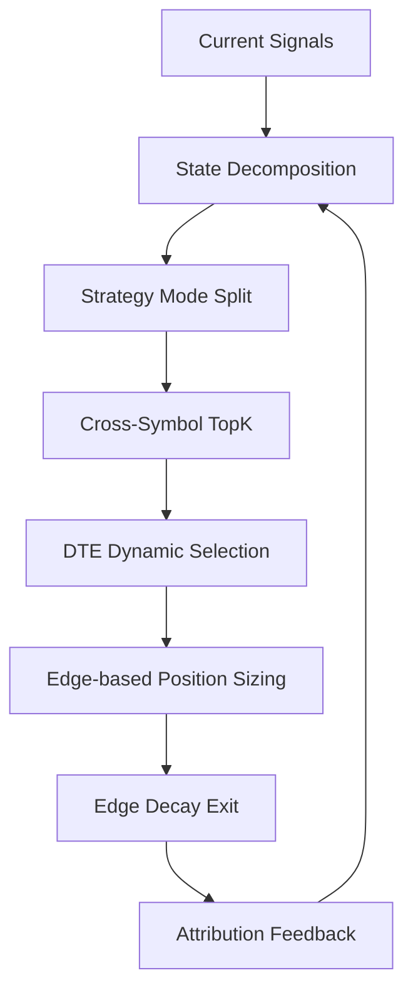

# 短期期权日内 Alpha Engine：提高收益路线文档

> 适用范围：QQQ / SPY / MAG7，0DTE / 1DTE / 2DTE  
> 目标：在不单纯加杠杆的前提下，提高系统的长期收益、稳定性和资金利用率。  
> 核心思想：收益提升来自 **筛选更准、交易更少、机会更强、仓位更聪明、退出更及时、跨标的更高效**。

---

## 0. 总结

这套系统后续提高收益，不应该从“提高单笔杠杆”入手，而应该从以下 7 个方向入手：

```text
1. State 更细
2. 交易模式分开
3. 跨标的 TopK
4. DTE 动态选择
5. Edge 分层仓位
6. Edge decay 出场
7. Gamma / Jump / Flow Exhaustion 进入核心因子
```

一句话：

> 不要试图让每个信号都赚钱，而是找到最赚钱的 State、最强的标的、最合适的 DTE，然后只做少数高 Edge 机会。

---

## 1. 当前发现说明了什么

你现在的测试结果是：

```text
IC 加权和 hot-score 顶部分位仍然是负均值
但按日 TopK + State 后，部分月份 call + stock_trend_down 出现正收益
```

这说明：

```text
Alpha 不是全局存在
Alpha 是条件性存在
```

也就是说：

```text
所有样本混在一起：
    可能负收益

某些 State + Direction + Time + DTE 组合：
    可能有明显正收益
```

所以后续重点不是继续追求全局 IC，而是寻找：

```text
Conditional Alpha
```

也就是：

```text
在什么 State 下，什么方向、什么 DTE、什么标的、什么时间段有可执行优势？
```

---

## 2. 收益提升的总体架构



核心循环：

```text
发现正收益组合
    ↓
继续拆细 State
    ↓
区分 Momentum / Reversal / Breakout
    ↓
跨标的排序
    ↓
选择最优 DTE
    ↓
动态分配仓位
    ↓
优化退出
    ↓
归因反馈
```

---

## 3. 第一优先级：把 State 拆细

你现在看到：

```text
call + stock_trend_down
```

在部分月份出现正收益。

这本身还不够，需要继续拆。

---

### 3.1 按时间拆

```text
call + stock_trend_down + opening
call + stock_trend_down + morning_trend_confirmation
call + stock_trend_down + midday
call + stock_trend_down + afternoon_repricing
call + stock_trend_down + power_hour
```

可能结果：

```text
opening：
    假反弹多，收益不稳定

midday：
    theta 衰减严重，收益差

power_hour：
    gamma / flow 重新定价，收益较好
```

---

### 3.2 按 IV / RV 拆

```text
call + stock_trend_down + high_iv
call + stock_trend_down + low_iv
call + stock_trend_down + iv_expansion
call + stock_trend_down + iv_compression
call + stock_trend_down + rv_expansion
```

可能结果：

```text
high_iv + iv_compression：
    Call 方向对了也不赚钱

low_iv + rv_expansion：
    Call 弹性更好

iv_expansion + price_reversal：
    可能是最好的反弹窗口
```

---

### 3.3 按 Gamma 拆

```text
call + stock_trend_down + positive_gamma
call + stock_trend_down + negative_gamma
call + stock_trend_down + gamma_flip_near
call + stock_trend_down + pin_risk_high
call + stock_trend_down + pin_risk_low
```

关键逻辑：

```text
Positive Gamma：
    更容易反转 / 均值回复

Negative Gamma：
    更容易趋势延续 / 下跌继续

High Pin Risk：
    买方期权容易被横盘和 theta 吃掉
```

所以：

```text
call + stock_trend_down
```

如果赚钱，很可能是：

```text
call + stock_trend_down + positive_gamma + flow_reversal
```

而不是：

```text
call + stock_trend_down + negative_gamma
```

---

### 3.4 按 Flow 拆

```text
call + stock_trend_down + put_flow_exhaustion
call + stock_trend_down + call_flow_reversal
call + stock_trend_down + net_delta_flow_positive
call + stock_trend_down + option_flow_divergence
call + stock_trend_down + stock_down_but_call_flow_up
```

重点寻找：

```text
价格还在跌
但 put flow 不再增强
call flow 开始进入
QQQ/SPY 开始修复
```

这可能是真正的反弹 Edge。

---

### 3.5 按大盘环境拆

```text
call + stock_trend_down + qqq_up
call + stock_trend_down + qqq_down
call + stock_trend_down + spy_up
call + stock_trend_down + sector_recovering
call + stock_trend_down + index_breadth_improving
```

例如：

```text
TSLA 下跌
但 QQQ 已经修复
并且 TSLA 的 put flow 衰竭
```

这比单独看 TSLA 更有意义。

---

### 3.6 目标状态

最终要从粗 State：

```text
call + stock_trend_down
```

升级成精细 State：

```text
call
+ stock_trend_down
+ oversold_reversal
+ positive_gamma
+ flow_reversal
+ qqq_recovering
+ power_hour
+ good_liquidity
```

这才可能是可交易 Alpha。

---

## 4. 第二优先级：把交易模式拆成三类

不要把所有信号都放进一个 Edge Score。

至少要拆成：

```text
1. Momentum Mode
2. Reversal Mode
3. Breakout Mode
```

因为这三种模式的入场、止损、持仓时间和退出逻辑完全不同。

---

## 4.1 Momentum Mode

适合状态：

```text
Trend Up / Trend Down
Negative Gamma
Flow continuing
Vol expansion
Liquidity good
VWAP slope 同向
Opening range break confirmed
```

做法：

```text
顺势做 Call / Put
允许持仓略长
用 pullback quality 判断加仓或继续持有
```

核心因子：

```text
TrendScore
FlowContinuationScore
VWAPSlope
RelativeStrength
VolExpansion
NegativeGammaScore
```

退出条件：

```text
TrendScore 衰减
Flow 消失
VWAP 失守
Vol expansion 结束
Edge 跌破阈值
```

---

## 4.2 Reversal Mode

适合状态：

```text
Stock trend down
但下跌衰竭
Put flow 减弱
Call flow 开始增加
价格远离 VWAP
QQQ/SPY 开始修复
Positive Gamma 或 Pin 支持反弹
```

这可能对应你现在发现的：

```text
call + stock_trend_down 正收益
```

但它本质上不是趋势策略，而是：

```text
Oversold Reversal / Mean Reversion
```

核心因子：

```text
OversoldScore
FlowExhaustionScore
VWAPDistance
IndexRecoveryScore
PositiveGammaScore
PinSupportScore
```

退出条件：

```text
回到 VWAP 附近
Call flow 没有继续
反弹失败
Spread 扩大
Edge decay
```

---

## 4.3 Breakout Mode

适合状态：

```text
Opening range break
Volume expansion
IV expansion
Relative strength rank top
Flow confirmation
Liquidity good
```

做法：

```text
突破确认后进入
失败立即退出
不等待深度回撤
```

核心因子：

```text
OpeningRangeBreak
VolumeAcceleration
IVExpansion
RelativeStrengthRank
AggressiveBuyRatio
```

退出条件：

```text
突破失败
回到 opening range 内
volume 跟不上
flow 消失
```

---

## 5. 第三优先级：跨标的 TopK

单做 QQQ 的收益上限有限。

后续收益提升主要来自：

```text
QQQ / SPY / NVDA / TSLA / META / AAPL / MSFT / AMZN / GOOGL
```

统一扫描，统一排序。

---

### 5.1 跨标的排序逻辑

每分钟计算：

```text
Edge(symbol, dte, direction, mode, state)
```

例如：

```text
Rank 1: TSLA 0DTE Call Reversal Edge 0.91
Rank 2: NVDA 0DTE Call Momentum Edge 0.86
Rank 3: QQQ 1DTE Put Breakout Edge 0.79
Rank 4: META 2DTE Call Momentum Edge 0.68
```

只做：

```text
Top1 / Top3 / Top5
```

不是每个标的都交易。

---

### 5.2 为什么跨标的能提高收益

因为每天真正有强 Edge 的标的不一样。

```text
某天：
    TSLA 最强

另一天：
    NVDA 最强

再一天：
    QQQ 最干净

有些天：
    所有标的都没有 Edge，应该空仓
```

你的系统目标不是做固定标的，而是：

```text
资金永远流向当前 Universe 中最强的少数机会。
```

---

### 5.3 避免伪分散

多个 MAG7 同时做 Call，并不一定是真分散。

可能本质上都是：

```text
Nasdaq beta
AI sector beta
mega-cap growth beta
```

所以组合层必须加入：

```text
correlation_penalty
```

例如：

```text
如果 NVDA / TSLA / QQQ 同时给 Call 信号：
    不能全部满仓
    需要降低总 Nasdaq beta 暴露
```

---

## 6. 第四优先级：DTE 动态选择

0DTE / 1DTE / 2DTE 不应该只是调参数，而应该让系统动态选择。

同一个 Signal 出现后，同时计算：

```text
0DTE risk-adjusted edge
1DTE risk-adjusted edge
2DTE risk-adjusted edge
```

选择最优。

---

## 6.1 0DTE

适合：

```text
Edge 极强
预期 5~20 分钟内快速移动
流动性极好
spread 很窄
state confidence 高
```

优点：

```text
弹性最大
资金效率最高
```

缺点：

```text
theta 极强
gamma 极高
容易被震出
spread 杀伤大
```

---

## 6.2 1DTE

适合：

```text
趋势比较明确
但 0DTE 容易被噪音震出
预计持仓 15~90 分钟
```

优点：

```text
弹性仍然高
容错率高于 0DTE
```

缺点：

```text
资金效率低于 0DTE
需要更明确的趋势或 IV 支持
```

---

## 6.3 2DTE

适合：

```text
趋势延续
事件前后
波动率扩张
更长持仓窗口
```

优点：

```text
容错更高
更适合方向 + IV 组合
```

缺点：

```text
弹性低于 0DTE
如果方向不够强，收益率不如 0DTE
```

---

## 6.4 DTE 选择公式

可以设计：

```text
DTE_Score =
  expected_option_return
/ expected_drawdown
* liquidity_score
* state_confidence
* theta_safety
* spread_efficiency
```

最终选择：

```text
argmax(DTE_Score)
```

示例：

```text
Signal: NVDA Call Momentum

0DTE:
    expected_return 高
    drawdown 高
    theta 风险高
    DTE_Score = 0.72

1DTE:
    expected_return 中高
    drawdown 中
    theta 风险中
    DTE_Score = 0.84

2DTE:
    expected_return 中
    drawdown 低
    theta 风险低
    DTE_Score = 0.70

选择：
    1DTE
```

---

## 7. 第五优先级：Edge 分层仓位

收益提升不能靠固定仓位。

应该用 Edge 分层：

```text
Edge < 0.70：
    不交易

0.70 <= Edge < 0.80：
    小仓 / 标准仓

0.80 <= Edge < 0.90：
    标准仓 / 加仓

Edge >= 0.90：
    高仓位，但必须满足流动性、相关性、回撤限制
```

---

## 7.1 仓位公式

```text
position_size =
base_size
* edge_strength
* liquidity_score
* state_confidence
* dte_safety
* correlation_penalty
* drawdown_control
```

解释：

```text
edge_strength：
    信号强度

liquidity_score：
    当前合约是否能顺利成交

state_confidence：
    当前 State 是否清晰

dte_safety：
    当前 DTE 是否适合这个信号

correlation_penalty：
    避免多个标的重复押同一个 beta

drawdown_control：
    当日回撤后自动降仓
```

---

## 7.2 示例

```text
账户：100,000 美元

机会 A：
    NVDA 0DTE Call
    Edge = 0.92
    Liquidity = good
    Correlation exposure = medium
    position = 25,000

机会 B：
    TSLA 0DTE Call
    Edge = 0.88
    Liquidity = medium
    Correlation exposure = high
    position = 15,000

机会 C：
    QQQ 1DTE Call
    Edge = 0.76
    Liquidity = very good
    Correlation exposure = high
    position = 8,000
```

---

## 8. 第六优先级：退出逻辑升级

短期期权中，退出逻辑往往比入场更重要。

常见问题：

```text
方向判断对了
期权最大浮盈很高
但最终只赚很少，甚至亏损
```

原因通常是：

```text
没有及时捕获 MFE
Edge 衰减后还在持有
State 已经反转
Flow 已经消失
Spread 扩大
Theta 开始吞噬收益
```

---

## 8.1 Edge Decay Exit

入场后持续监控 Edge。

示例：

```text
入场 Edge = 0.88

当前 Edge = 0.72：
    继续持有

当前 Edge = 0.63：
    减仓

当前 Edge = 0.50：
    全部退出
```

---

## 8.2 多条件退出

需要加入：

```text
1. State reverse exit
2. Flow disappear exit
3. Spread widening exit
4. VWAP fail exit
5. Time decay exit
6. Pin strike exit
7. MFE trailing exit
8. Hard stop loss
```

---

## 8.3 MFE Capture Ratio

这是提高收益非常重要的指标。

```text
MFE Capture Ratio = Final PnL / Maximum Favorable Excursion
```

例如：

```text
最大浮盈 +80%
最终出场 +20%

MFE Capture Ratio = 25%
```

说明：

```text
入场可能没问题
退出有明显问题
```

目标：

```text
0DTE：
    MFE Capture Ratio 尽量 > 40%

1DTE / 2DTE：
    MFE Capture Ratio 可以略低，但要换取更高胜率和更低回撤
```

---

## 9. 第七优先级：加入 Jump / Gamma / Flow Exhaustion

这些是 0DTE 和短期期权的关键。

---

## 9.1 Jump Score

需要单独建：

```text
open_jump_score
close_jump_score
macro_event_jump_score
vol_expansion_after_open
power_hour_jump_score
```

时间段要分开处理：

```text
09:30 - 10:00：
    Opening Jump / Drive

10:00 - 11:30：
    Trend Confirmation

11:30 - 14:00：
    Decay / Chop

14:00 - 15:30：
    Repricing

15:30 - 16:00：
    Power Hour / Gamma / Pin
```

---

## 9.2 Gamma State

核心因子：

```text
positive_gamma_score
negative_gamma_score
gamma_flip_distance
pin_risk_score
strike_gamma_concentration
atm_gamma_pressure
```

解释：

```text
Positive Gamma：
    更容易反转、横盘、压波

Negative Gamma：
    更容易趋势延续、波动放大

High Pin Risk：
    买方期权容易被 theta 消耗
```

---

## 9.3 Flow Exhaustion

这是 Reversal Mode 的关键。

需要识别：

```text
put_flow_exhaustion
call_flow_exhaustion
delta_flow_divergence
price_down_but_put_flow_weakening
price_down_but_call_flow_entering
stock_down_but_index_recovering
```

特别关注：

```text
价格仍然在跌
但推动下跌的 flow 已经减弱
```

这类信号往往比单纯的“跌多了”更可靠。

---

## 10. 从收益率优化改成交易质量优化

不要只看日收益率。

后续应该重点看：

```text
Average MFE
Average MAE
MFE Capture Ratio
Time to Profit
Edge Decay After Entry
Slippage / Gross PnL
State Accuracy
Mode Accuracy
TopK Rank Return
```

---

## 10.1 关键指标解释

### Average MFE

```text
平均最大浮盈。
```

如果 MFE 高但最终收益低，说明退出有问题。

### Average MAE

```text
平均最大浮亏。
```

如果 MAE 高，说明入场点或止损有问题。

### MFE Capture Ratio

```text
最终收益捕获了多少最大浮盈。
```

这是短期期权系统非常关键的指标。

### Time to Profit

```text
入场后多久进入盈利。
```

0DTE 如果入场后长时间不盈利，通常应该尽快退出。

### Slippage / Gross PnL

```text
滑点吃掉了多少毛利润。
```

如果这个比例太高，说明策略不适合实盘或需要更严格的 liquidity filter。

---

## 11. 收益提高的阶段路线图

---

### 阶段 1：QQQ 单标的 State 验证

目标：

```text
验证 State × Direction × Time × DTE 是否真的存在条件收益。
```

任务：

```text
1. 拆 Trend Up / Trend Down / Range / Vol Expansion
2. 拆 Call / Put
3. 拆 Open / Midday / Power Hour
4. 拆 0DTE / 1DTE / 2DTE
5. 记录 Conditional Return / Sharpe / Drawdown
```

判断标准：

```text
至少找到 2-3 个 State 组合具有稳定正收益。
```

---

### 阶段 2：加入 NVDA / TSLA 做跨标的 TopK

目标：

```text
从单标的收益，升级为跨标的机会选择。
```

任务：

```text
1. 为 NVDA / TSLA 建 Symbol Profile
2. 统一计算 Edge
3. 每分钟做 TopK 排序
4. 比较 Top1 / Top3 / 全交易的收益差异
```

判断标准：

```text
TopK 收益显著优于全交易和单 QQQ。
```

---

### 阶段 3：加入 DTE 动态选择

目标：

```text
不同信号选择最合适的 0DTE / 1DTE / 2DTE。
```

任务：

```text
1. 同一个 Signal 同时回测 0DTE / 1DTE / 2DTE
2. 计算 risk-adjusted DTE score
3. 动态选择最优 DTE
```

判断标准：

```text
动态 DTE 选择优于固定 0DTE。
```

---

### 阶段 4：Momentum / Reversal / Breakout 分开

目标：

```text
避免不同交易模式互相污染。
```

任务：

```text
1. 分别定义三套 Edge
2. 分别回测三套模式
3. 分别设置止损、止盈、持仓时间
4. 分别做归因
```

判断标准：

```text
至少一套模式有稳定正收益，且模式之间相关性不完全一致。
```

---

### 阶段 5：加入 Gamma / Pin / Jump / Flow Exhaustion

目标：

```text
让系统更贴近 0DTE 的真实市场机制。
```

任务：

```text
1. 计算 gamma regime
2. 计算 pin risk
3. 计算 jump score
4. 计算 flow exhaustion
5. 把这些加入 State Gate 和 Edge
```

判断标准：

```text
加入后亏损交易减少，MFE Capture Ratio 提高，回撤下降。
```

---

### 阶段 6：轻量模型学习 State 权重

目标：

```text
从人工权重升级为数据驱动权重。
```

推荐模型：

```text
LightGBM
XGBoost
CatBoost
Logistic Regression
Online Ridge
IC-weighted ensemble
```

输入：

```text
State + Factors + SymbolProfile + DTEProfile
```

输出：

```text
future_tradeable_edge
```

标签：

```text
未来 5~15 分钟可执行期权收益是否足够高
且最大回撤是否可接受
```

判断标准：

```text
模型必须在 walk-forward 中优于规则版。
```

---

### 阶段 7：组合分配与相关性控制

目标：

```text
从单机会交易升级为组合级资金分配。
```

任务：

```text
1. 控制总 Nasdaq beta
2. 控制单标的最大风险
3. 控制同向 Call / Put 集中度
4. 控制日内最大回撤
5. 动态降低亏损日仓位
```

判断标准：

```text
收益不一定大幅提高，但回撤和波动应显著下降。
```

---

## 12. 收益目标应该怎么设

小资金阶段，不要用固定日收益率作为唯一目标。

更合理的目标：

```text
1. 找到稳定正收益 State
2. 提高 TopK 后的收益
3. 降低无效交易数量
4. 提高 MFE Capture Ratio
5. 降低滑点占比
6. 降低最大回撤
```

### 12.1 现实目标区间

如果系统设计有效，小资金阶段可以追求：

```text
普通交易日：
    小赚 / 小亏 / 不交易

强趋势日：
    账户级收益 2% - 5% 有可能

极端高 Edge 日：
    账户级收益 5% - 10%+ 有可能

长期目标：
    日均 0.5% - 1% 已经非常优秀
```

但需要注意：

```text
长期稳定日均 5% 基本不可持续。
```

真正决定长期复利的是：

```text
少亏大亏日
少做低 Edge 交易
高 Edge 日敢于合理加仓
退出及时
```

---

## 13. 盘后归因模板

每天盘后输出：

---

### 13.1 Overall

```text
Date:
Universe:
Total Trades:
Gross PnL:
Net PnL:
Win Rate:
Avg Win:
Avg Loss:
Profit Factor:
Max Intraday Drawdown:
Slippage Cost:
Commission Cost:
```

---

### 13.2 By State

```text
State:
Trades:
Net PnL:
Win Rate:
Avg Return:
Sharpe:
Max Drawdown:
MFE:
MAE:
MFE Capture:
```

---

### 13.3 By Mode

```text
Mode: Momentum / Reversal / Breakout
Trades:
Net PnL:
Win Rate:
Avg Hold Time:
Avg MFE:
Avg MAE:
MFE Capture:
```

---

### 13.4 By Symbol

```text
Symbol:
Trades:
Net PnL:
Win Rate:
Avg Return:
Slippage:
Best State:
Worst State:
```

---

### 13.5 By DTE

```text
DTE:
Trades:
Net PnL:
Win Rate:
Avg Return:
Avg Drawdown:
Theta Loss Proxy:
Spread Cost:
```

---

### 13.6 Failure Analysis

```text
亏损是否集中在某个 State？
亏损是否集中在某个时间段？
亏损是否集中在某个 Symbol？
亏损是否集中在某个 DTE？
是否因为 spread 扩大？
是否因为 Edge 已经衰减但没有退出？
是否因为多个 MAG7 同向暴露过高？
是否因为 Momentum / Reversal 模式混淆？
```

---

## 14. 最重要的 10 条原则

```text
1. 提高收益不是加杠杆，而是减少低质量交易。
2. 全局 IC 不重要，Conditional Alpha 更重要。
3. 粗 State 只能证明可能有信号，细 State 才能形成可交易 Alpha。
4. Momentum / Reversal / Breakout 必须分开。
5. QQQ 不是核心，跨标的 TopK 才是收益扩展核心。
6. 0DTE / 1DTE / 2DTE 要动态选择，不是简单调参数。
7. 仓位必须根据 Edge、流动性、状态置信度和相关性动态变化。
8. 出场逻辑比入场逻辑更影响短期期权收益。
9. Gamma / Jump / Flow Exhaustion 是 0DTE 的核心机制因子。
10. 每一次优化都必须通过 State × Mode × Symbol × DTE 归因验证。
```

---

## 15. 最核心的一句话

> 后续提高收益的关键，不是让系统在所有时间都预测正确，而是让系统只在少数高 Edge 状态中出手，并把资金集中到当前全市场最强的 1-3 个机会，同时用 Edge decay 和风险控制及时退出。

