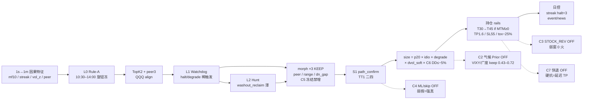

# CORE 基线架构重审：因果边 vs 市场适应力

> 复盘：2026-08-13  
> 范围：peer3 **research_baseline**（Rule-A 10:30+），不含 AM 卫星升线叙事  
> 背景：[`research_full_day_peer3_baseline.md`](research_full_day_peer3_baseline.md) · [`watchdog_stack_architecture.md`](watchdog_stack_architecture.md) · [`MAG7_Trend_Day_Detection_Architecture.md`](../MAG7_Trend_Day_Detection_Architecture.md)  
> 结论先行：**CORE 不是「没因果边」，而是「边被钉在固定分布上，适应层用补丁堆叠代替状态预算」——行情结构一变，系统不会自动换风险态，只会再挂一门。**

---

## 0. 现行 CORE 实际是什么

```text
生产 freeze   googl_peer3_v1          更瘦；Watchdog 多 stub
研究脊骨      extend_mtm_full_day_peer3_v1
              L0 Rule-A (10:30–14:00) + peer3 TopK2
              L1 Watchdog (degrade/halt)
              L2 Hunt (washout_reclaim)
              + entry morph BLOCK ×3（peer_gap / range_stall / dn_gap；C5 已冻）
              + S1 / toxic / giveback extend
AM 卫星       pulse / am_v2           shadow only，不进本文件主叙事
```

两条「冻结」别混：研究叙事在 **research_baseline**；生产默认仍是更瘦的 `googl_peer3_v1`。

---

## 0.1 现行闭环（C0–C7 实测后）



| 颜色读法 | 含义 |
|----------|------|
| 实线主链 | 研究脊骨在跑 |
| morph×3 | C5 KEEP，`no_net_new_hard_block` |
| C6 | 唯一可迁移适应：已实现权益回撤预算 |
| 虚线 C2/C3/C4/C7 | 已验收 FAIL，模块可留、默认 off |

弱窗对照（含 C6）：约 **+2.0 / n=34 / MaxDD −7.1%**。强窗约 **+71 / n=65**。当前环境按弱窗读。

---

## 1. CORE 闭环（因果已站住的部分）

```text
1s→1m 因果特征 (mf10 / streak / vol_z / peer)
     → Rule-A 首火 + TopK earliest (≤2)
     → peer3 + QQQ align + Watchdog 态
     → entry morph 门 + TT1(二四)
     → open_ladder 锁约
     → size: p20 × mf_idio × degrade × dvol_soft × session_dd_budget
     → 持仓: TP1.6 / SL≈55% / toxic / S1 / hold_extend(+giveback)
     → 日控: streak halt / event+news blackout
```

**因果 rails（不要再怀疑这一层）**

| 轨 | 状态 |
|----|------|
| `decision_ts ≥ feature_ts + 60s`（预聚合 1m） | 已强制；旧 delay=0 作废 |
| asof / pending_path（S1、Hunt） | live↔replay 对拍 ok |
| peer / morph 用 feature 或 entry 时钟分清 | 已文档化 |
| 升线要双窗；quote 门挡假晋级 | 纪律在，执行有时松 |

→ 「没有未来函数还能不能优化」：**能。** 问题不在时钟，在 **目标分布变了之后系统不会换姿态**。

---

## 2. 为什么「行情一变就难盈利」——架构层，不是调参层

### D1. 主引擎是固定规则，不是状态机预算（最致命）

Rule-A 旋钮（streak8 / fo2% / vol_z1 / peer3 / 10:30 窗）在 **2026 强趋势窗** 上被确认最优。  
弱窗（Jan–Mar）只做到「仍为正」，不是 regime-robust 证明。

```text
市场结构变了
    → 同一套 mf10×streak 仍会开火
    → 没有「今天风险预算应砍半 / 应收口」的一等公民层
    → 只能靠事后再发现一个 loss-day → 再加一个 morph BLOCK
```

这是 **补丁适应**，不是 **状态适应**。

### D2. 适应层全是「窄硬门」，没有可推广的 Regime Prior

| 已有 | 本质 |
|------|------|
| event calendar / company_news | 外生黑名单 |
| peer_gap / range_stall / dn_gap stall（C5 KEEP） | 单形态硬 BLOCK；overnight/up/fo_lod 已 DEPRECATED |
| L1 reclaim/washout | 日初少数离散态 |
| mf_idio / dvol_soft / **session_risk_budget（C6）** | 仓位：前两者微调；C6 按已实现权益 DD 收剩余风险 |
| Hunt | 极薄样本，故事拟合风险高 |

**缺的（C2 后仍缺气候 Prior；C6 补的是路径预算）**：不要再用 10:30 VIXY/广度当「今天是不是弱气候」。可迁移的是 **已实现状态**（权益相对峰值的回撤）→ 剩余仓位。C6 已接线研究脊骨；气候分类仍 FAIL。

目标架构 V2（[`MAG7_Trend_Day_Detection_Architecture.md`](../MAG7_Trend_Day_Detection_Architecture.md)）里的 Layer1 Regime Prior / Layer4 Failure Detector **尚未成为 CORE 生产环**。

### D3. 退出仍是固定 rails，路径失效不会主动认输

默认：T30→T45 extend + 硬 SL≈55% + toxic 窗口。  
趋势变宽变窄、午后均值回归增强时，仍用同一 hold 时钟。  
L3 `STOCK_REV` 已在当前脊骨上验收（C3 FAIL：弱窗不触发、强窗砍肥）；C7 把已有 `delta_time_stop` / `mtm_floor` 按弱窗主门再验一次（FAIL：硬抗与延迟 TP 同路径）。hold_watchdog 仍 shadow —— **入场补丁远多于可用的持仓适应**。

### D4. 强窗叙事掩盖适应债

May–Jul 量级上千 % 的 offline 数字，让「再加一门 keep≥0.95」成为默认进化方式。  
Jul 结构变化后的救援线是 **event/news/gap morph**，不是换主策略 —— 文档自己已诚实写出。  
结果：系统越来越像 **2026H1 loss-day 百科全书**，越来越不像 **可迁移的交易状态机**。

### D5. 生产 freeze ≠ 研究脊骨

研究叠了 L1/L2/S1/morph；生产仍偏瘦。  
适应力讨论若对着研究脊骨，运维却跑 freeze —— **真实适应能力被高估或低估都有可能**，先对齐「以哪条脊骨为北星」。

### D6. 双轨验收（prints vs quote）仍会制造假安全感

CORE 主路径相对 AM 好一些，但 toxic / 部分 sleeve 仍有 trade-last 叙事。  
适应升级若只在 prints 上好看，结构一变 + 可执行世界变差时会二次翻车。

---

## 3. 诊断：边还在吗？适应在哪断？

| 问题 | 判断 |
|------|------|
| 有没有未来函数？ | 主环因果 rails **已站住**；优化空间在规则与适应层，不是再挖 60s 前视 |
| 有没有边？ | 强窗有、弱窗薄正；**边绑在分布上** |
| 有没有适应？ | 有窄补丁；**无通用状态预算** |
| 行情变化后为何难赚？ | 开火逻辑不变 + 退出时钟不变 + 只能事后加门 → **过拟合补丁累积** |

一句话：  
**因果边还在「同一市场气候」里；气候一变，CORE 不会换挡，只会刹车片越加越多。**

---

## 4. 升级北星（架构，不是又一个 morph）

锁定唯一目标：

```text
北星 C — 可适应的因果 CORE
  1) Rule-A / TopK 座位逻辑保持可读（不大拆成黑盒主开火）
  2) 增加一等公民：因果 Regime Prior（只缩放风险，不发假方向）
  3) 增加一等公民：持仓 Failure Detector（结构失效快退）
  4) 验收：walk-forward / 多气候窗，不只是 may_jul × jul10_23 keep≥0.95
  5) 禁：为救单日再叠硬 BLOCK；禁 densify 冒充适应
```

与 V2 文档对齐的分层（建议落地顺序）：

```text
L0  Rule-A 候选（只读主开火，旋钮冻结）
L1' Regime Prior（软）—— C2 气候标签 FAIL；C6 改为已实现权益 DD → size（不发方向）
L1  Watchdog 离散态（保留 halt/degrade，收口为少数态）
L2  Hunt（样本门槛不达标则保持 off/shadow）
L3  Entry Validator（只拒明显假；训练对象=实际 TopK，不是全候选）
L4  Failure Detector + 动态退出（替代「只会 extend」）
L5  窄专家 registry（形态补丁降级为可选 overlay，不再是默认进化路径）
```

---

## 5. 分步门控（一步一测）

| Step | 内容 | PASS | 失败动作 |
|------|------|------|----------|
| **C0** | 对齐北星：研究脊骨 vs 生产 freeze；本文档落地 | 文档+profile 标注 | — |
| **C1** | 气候地图：按因果 regime 切片报 CORE PnL（不调参） | 看清「哪类天在赚钱」 | 先别加 morph |
| **C2** | Regime Prior v1（软缩放 only） | 双气候窗 total 不差于基线且弱气候 MaxDD↓ | 回退，不改 L0 |
| **C3** | Failure detector / 路径退出 v1（L3 STOCK_REV overlay） | 同窗 keep≥0.95 且尾损↓ | **FAIL 2026-08-13**：保持 T30 rails；不接线 |
| **C4** | Entry validator（TopK 一致对象） | 误杀可控 + 弱窗改善 | **FAIL 2026-08-14**：不接 ML router |
| **C5** | morph 债务审计：可被 L1'/L4 覆盖的门标记 DEPRECATED | 门数量下降 | **PASS 2026-08-14**：6→3；冻结禁止再净增 |
| **C6** | 可迁移状态预算：已实现权益 DD 软缩仓（非气候标签） | 双窗 keep≥0.95 且弱窗 MaxDD↓ | **PASS 2026-08-14**：dd5×0.5；强 keep 0.998 |
| **C7** | 持仓失效快退（弱窗主门；已有 delta/mtm_floor 臂） | 弱窗时钟亏改善且 keep≥0.85；强 keep≥0.70 为代价 | **FAIL 2026-08-14**：硬抗=延迟 TP；不接线 |

任意 Step：**不改 Rule-A 全局阈值** 除非 walk-forward 明确要求；一天最多动 1 个适应层旋钮。

---

## 6. 明确不做（防旧病复发）

- 不为「提高收益」重开 AM densify / 前视网格当引擎  
- 不把 trade-last 上界当 CORE 适应证据  
- 不用全天趋势标签在 10:30 硬禁交易（反因果）  
- 不把 Jul 救援形态无限写进默认脊骨  
- 不平行开 ML router + 新 morph + 新 exit（目标函数必漂）

---

## 7. 和 AM v2 的边界

| | CORE（本文件） | AM v2 |
|--|----------------|-------|
| 钟 | 10:30–14:00 主账 | 10:00–11:30 卫星 shadow |
| 问题 | 适应力 / 气候迁移 | 可执行开盘卫星 |
| 升级 | Regime + failure exit | quote FillSpec 纪律 |

AM 不替代 CORE 适应层；CORE 适应力不足时，加卫星只会多一条漏斗。

---

## 8. C1 气候地图（PASS — 地图完成）

产物：`/mnt/s990/data/maga7/results/research_core_climate_map_v1/`  
工具：`maga7/tools/run_core_climate_map.py`  
语料：S1 research_baseline accept（131 笔，不改交易逻辑）

| 发现 | 数字 |
|------|------|
| 贡献集中 | Apr–May **46%** + Jun–Jul09 **32%** ≈ **78%** |
| 弱气候 | Jan–Mar n=53 但 win **45%**、share 仅 **16%** |
| QQQ 方向 | up/dn 贡献各 ~39% —— 不是单边牛市引擎 |
| 广度 | `breadth_up` share **57%**；`breadth_mid` win 41% |
| Watchdog | `normal` 贡献 **90%**；degrade≈0 —— **离散适应几乎未触发** |

**C1 裁决**：适应债坐实。下一刀 **C2 = 软缩仓 Prior**（弱气候/散度中性/高压 VIXY），禁止新硬 BLOCK。

```bash
PYTHONPATH=. python -m maga7.tools.run_core_climate_map \
  --tag research_core_climate_map_v1
```

---

## 8.1 C2 气候软 prior（FAIL）

产物：`/mnt/s990/data/maga7/results/research_core_c2_climate_prior/`  
工具：`maga7/tools/run_core_c2_climate_prior.py`  
动作：同笔交易只乘 `size_frac`；live 门 = 10:30 VIXY z / Mag7 breadth mid（**不用日历**）

| 变体 | 弱窗 keep / MaxDD | 强窗 keep | 裁决 |
|------|-------------------|----------:|------|
| vixy / breadth / OR 缩仓 | 弱窗更好 | **0.43–0.72** | 强窗被砍 |
| AND 缩仓 | 几乎不触发 | ~1.00 | 假适应 |

**C2 FAIL**：能救弱窗回撤的 10:30 日因子，在强窗是同一套赚钱气候。日级软缩仓分不开家门口与弱气候。

不写入 research_baseline 默认。`common/climate_prior.py` + replay 挂钩保留，`enabled=false`。

```bash
PYTHONPATH=. python -m maga7.tools.run_core_c2_climate_prior \
  --tag research_core_c2_climate_prior
```

---

## 8.2 C3 路径失效退出（FAIL）

产物：`/mnt/s990/data/maga7/results/research_core_c3_stock_rev/`  
工具：`maga7/tools/run_core_c3_stock_rev.py`  
动作：不新造 FailureDetector。把 Jul-22 L3 冠军 `wash_m3_uw_h10`（`STOCK_REV`，`mixed_wash_up`，min_hold 10m，stock_max=−0.3%）叠到 **当前** `extend_mtm_full_day_peer3_v1`。Replay 已实现该臂；对照是当前 profile 空 overlay，不是更旧的 S1 簿。

| 窗 | 当前 baseline | overlay | keep | STOCK_REV | 裁决 |
|----|---------------|---------|-----:|----------:|------|
| 弱 Jan–Mar | +2.25 n=34 | 完全相同 | 1.00 | **0** | 日门未武装 |
| 强 Apr–Jul | +69.79 n=62 deep=−0.46 | +61.62 deep=−0.87 | **0.885** | 4 | 砍右尾 |

强窗 4 笔截断相对原 T30/T45 **全部更差**（两笔原时钟赢家变成 −10%/−25%）。弱窗零触发：需要适应的气候没有 wash 日门。

**C3 FAIL**：同窗 keep 0.885 < 0.95，且尾损加深。Jul-22 在更瘦 peer3 上 retain≈0.91 过当时 0.85 条；morph 栈已经清掉那些毒性入场后，L3 只剩误杀。

不写入 research_baseline。不调 `stock_max` 网格冒充新适应层。`common/failure_detector.py` 是 smooth/impulse 股票漏斗，不是 CORE 期权轨。

```bash
PYTHONPATH=. python -m maga7.tools.run_core_c3_stock_rev \
  --tag research_core_c3_stock_rev
```

---

## 8.3 C4 入场校验（FAIL）

产物：`/mnt/s990/data/maga7/results/research_core_c4_entry_validator/`  
工具：`maga7/tools/run_core_c4_entry_validator.py`  
对象：当前 CORE 期权 TopK 成交簿（C3 baseline，弱 34 + 强 62），**不是**全候选。  
动作：入场可见特征 post-hoc skip；**不训练、不接线** TCN / LGBM。

| 变体 | 弱窗 skip / 拒绝精度 | 强窗 keep | 裁决 |
|------|----------------------|----------:|------|
| `|from_open|<1%` | 7 / 71% | **0.26** | 强窗同一特征是主引擎 |
| FO<1% ∧ 无 S1 | 6 / 83% | **0.40** | 精度最好仍砍肥 |
| 无 S1 confirm | 18 / 50% | 0.16 | 误杀一半赢家 |
| skip Hunt | 0 | 0.59 | 弱窗不触发 |
| rebound_trap 1 笔 | 1 | 1.00 | 假适应 |

**C4 FAIL**：席位层重复了 C2 的气候纠缠——弱窗「假」在强窗是真。股票漏斗 Top2 LightGBM 已 OOS 0/3；`seat_score_gate` 已 REJECT。本轮不升级模型复杂度。

不接 ML router。`tcn_gate` / `lgbm_bouncer` / `seat_score_gate` 保持 off。

```bash
PYTHONPATH=. python -m maga7.tools.run_core_c4_entry_validator \
  --tag research_core_c4_entry_validator
```

---

## 8.4 C5 morph 债务审计（PASS — 6→3）

产物：`/mnt/s990/data/maga7/results/research_core_c5_morph_debt/`  
工具：`maga7/tools/run_core_c5_morph_debt.py`  
对照：C3 当前脊骨 baseline（弱 +2.25 n=34 / 强 +69.79 n=62）。L1'/L4 已 FAIL，**不能**当拆门借口；只关 strip keep≥0.95 的门。

| 门 | strip keep 弱/强 | 裁决 |
|----|------------------|------|
| `range_stall` | 0.90 / **0.73** | KEEP（弱窗 +17 笔、强窗 +7，主力） |
| `peer_gap` | 0.97 / **0.87** | KEEP |
| `dn_gap_stall` | **0.89** / 1.00 | KEEP |
| `overnight_gap` | 1.00 / **1.06** | DEPRECATED（净负） |
| `up_gap_stall` | 1.00 / 0.965 | DEPRECATED |
| `fo_lod_chase` | 1.00 / 1.00 | DEPRECATED（block 未变成成交） |
| 六门全拆 | 0.72 / 0.58 | 栈整体仍承重 |

三门合关确认 keep 1.00 / **1.025**。已写入 research_baseline：`enabled=false` + `morph_debt.policy=no_net_new_hard_block`。生产 freeze 不动。

```bash
PYTHONPATH=. python -m maga7.tools.run_core_c5_morph_debt \
  --tag research_core_c5_morph_debt --variants all+bundle
```

---

## 8.5 C6 可迁移状态预算（PASS — 已实现 DD）

产物：`/mnt/s990/data/maga7/results/research_core_c6_session_budget/`  
工具：`maga7/tools/run_core_c6_session_budget.py`  
对照：C5 drop3 当前脊骨（弱 +2.25 n=34 / 强 +71.57 n=65）。  
动作：同笔只乘 `size_frac`；live 门 = **入场时权益/峰值回撤**，不是 10:30 气候，不是日历。

C2 的教训：能描述弱窗的日因子，在强窗是同一套赚钱气候。C6 换问题——不问「今天像不像弱气候」，问「**账上已经亏了多少，还剩多少风险预算**」。

| 变体 | 弱 keep / ΔMaxDD | 强 keep | n 弱/强 | 裁决 |
|------|------------------|--------:|---------|------|
| after_day_loss ×0.5 | 0.86 / +1.7pp | **0.57** | 15/15 | 负对照：连亏后的恢复日两窗都赚 |
| second_seat ×0.5 | 0.84 / 0 | **0.67** | 8/16 | 负对照：砍强窗第二席 |
| dd3 ×0.5 | 0.86 / +1.7pp | **0.90** | 13/5 | 过浅，变相 C2 |
| **dd5 ×0.5** | **0.975 / +1.7pp** | **0.998** | **8/2** | **WIRE** |
| dd6 ×0.5 | 0.971 / +0.9pp | 1.00 | 4/**0** | 假适应 |
| linear10 | 0.87 / +2.1pp | **0.80** | 18/16 | 过密 |

弱窗 8 笔几乎全是次日首席（前一日已平，因果）。强窗只碰到 06-26 的洞。同一条规则，开火率随路径变，不随日历变。

已写入 research_baseline `trade.session_risk_budget`（`dd_step` −5% ×0.5）。replay / OMS dry+stub 已挂钩。生产 freeze 不动。`climate_prior` 仍 off。

```bash
PYTHONPATH=. python -m maga7.tools.run_core_c6_session_budget \
  --tag research_core_c6_session_budget
```

---

## 8.6 C7 持仓失效快退（FAIL — 弱窗主门仍过不了）

产物：`/mnt/s990/data/maga7/results/research_core_c7_hold_failfast/`  
工具：`maga7/tools/run_core_c7_hold_failfast.py`  
对照：当前脊骨（C5 drop3 + C6 DD）。验收已按「当前≈弱窗」改成弱窗主门，强窗 keep 只作代价上限 0.70。

| 变体 | 弱 keep | 强 keep | early 弱/强 | 强 TP |
|------|--------:|--------:|-------------|------:|
| `delta_stall_5m` | **0.70** | **0.05** | 18 / 42 | 34→16 |
| `floor_red_h15` | **0.65** | **0.27** | 17 / 28 | 34→27 |
| `floor_m10_h10` | **0.75** | **0.11** | 11 / 28 | 34→25 |

时钟磨亏被砍掉了（弱 clock_loss −0.89→~0），但弱窗 15 笔 TP 里有先红后打的腿，一并被切断。硬抗和延迟 TP 是同一条路径。

**C7 FAIL。不接线。** `delta_time_stop` / `mtm_floor` / `STOCK_REV` 保持 off。T30 + toxic −25%。

```bash
PYTHONPATH=. python -m maga7.tools.run_core_c7_hold_failfast \
  --tag research_core_c7_hold_failfast
```

---

## 9. 北星进度

1. ~~C0 / C1~~ 地图完成  
2. ~~C2~~ FAIL — 日级软缩仓分不开强弱气候  
3. ~~C3~~ FAIL — STOCK_REV 在当前脊骨砍肥  
4. ~~C4~~ FAIL — 实际 TopK 没有「只拒明显假」；不接 ML  
5. ~~C5~~ PASS — morph 硬门 6→3；**禁止再净增 BLOCK**  
6. ~~C6~~ PASS — 已实现权益 DD 状态预算（dd5×0.5）  
7. ~~C7~~ FAIL — 持仓快退砍的是延迟 TP，弱窗自己也靠这条腿  

站在弱窗里，能动的适应层目前是 **C6 回撤预算**（入场后少加仓），不是提前平仓。L4 需要能分开「磨死」和「先红后 TP」的路径证据；现有 delta/floor/REV 做不到。禁止再加 morph 冒充持仓适应。  
