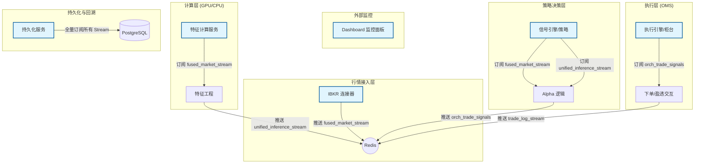

# V8 解耦架构与数据流规范

本文档详细描述了 V8 交易系统解耦后的服务间通信标准、数据格式及 Redis 消费逻辑。

## 1. 系统拓扑图 (Mermaid)

## 2. Redis Stream 数据字典

| Stream 名称 | 生产者 | 消费者 | 消费组 (Group) | 数据键 (Key) | 序列化格式 | 内容描述 |
| :--- | :--- | :--- | :--- | :--- | :--- | :--- |
| `fused_market_stream` | IBKR 连接器 | 特征服务, 信号引擎, 持久化 | `feat_group`, `sig_group`, `pg_group` | `batch` | List[Dict] | 5秒级的同步正股 K 线与期权桶数据 |
| `unified_inference_stream` | 特征服务 | 信号引擎, 持久化 | `sig_group`, `pg_group` | `data` | Dict | 预计算好的归一化特征向量 |
| `orch_trade_signals` | 信号引擎 | 执行引擎 (OMS) | `oms_group` | `data` | Dict | 交易信号 (BUY/SELL) 或 SYNC 同步点 |
| `trade_log_stream` | 执行引擎 / 信号 | 持久化, Dashboard | `pg_group` | `pickle` | Dict | 交易成交细节、持仓及收益日志 |

## 3. 序列化协议 (Phase 4 深度优化)

全链路高频流现已统一使用 **Msgpack**，并集成了自定义的 Numpy 支持：

> [!IMPORTANT]
> 必须使用 `production/utils/serialization_utils.py` 进行所有 `pack`/`unpack` 操作，以确保 `np.ndarray` 和 `np.float32` 在传输过程中类型不丢失。

### 编码逻辑 (`ser.pack`)
- 自动检测 `np.ndarray` 并将其转换为 `{ b'__nd__': True, b'data': ..., b'dtype': ..., b'shape': ... }` 格式。
- 二进制压缩格式，极大降低了 Redis 内存压力。

### 解码逻辑 (`ser.unpack`)
- 自动兼容 **Pickle** (旧格式) 和 **Msgpack**。
- 按需还原 Numpy 数组及其原始维度和数据类型。

## 4. 维护与故障排查
- **消费组重置**: 若数据处理卡号或需要重新回放，执行 `XGROUP SETID <stream> <group> 0`。
- **软批处理 (Soft Batching)**: `IBKR 连接器` 采用 300ms 聚合窗口，将多标的行情打包为单条 `batch` 消息同步推送，解决实盘特征畸变问题。
- **同步哨兵 (Sync Sentinel)**: `信号引擎` 在每帧处理结束时必须推送 `SYNC` 动作，以保证 `LIVEREPLAY`下执行引擎的确定性时钟同步。
