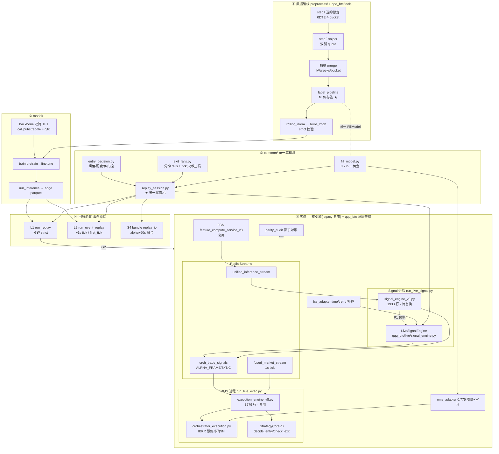
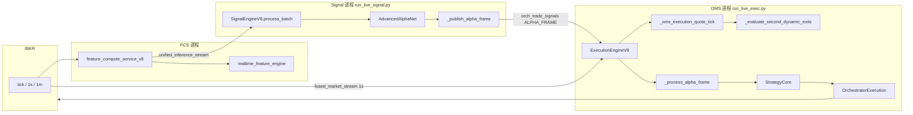
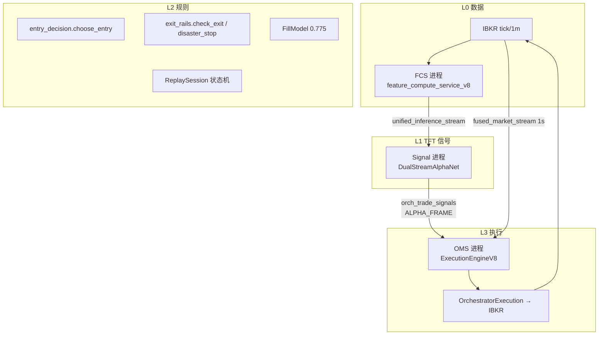
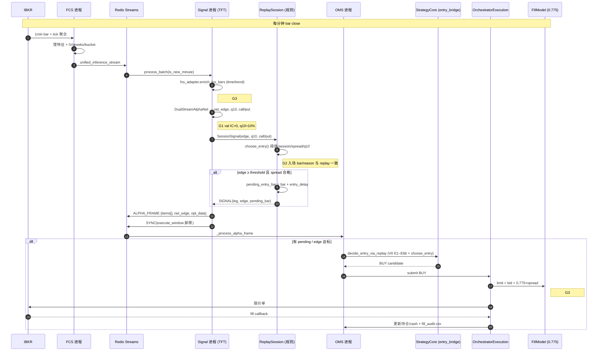
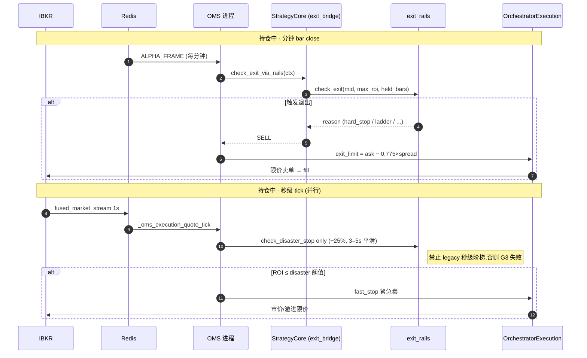

# qqq_btc — 单标的深流动性量化路径(QQQ 0DTE 期权 + BTC 永续)

第三代路径。与 `production/`(legacy 多标的截面)、`New_Pro/`(QQQ 0DTE 过渡版)完全隔离,
不修改旧路径任何文件;复用旧代码中已验证正确的逻辑,重写有结构缺陷的部分。

> **分阶段里程碑与 MAG7 模型集群设计** → [CLUSTER_ROADMAP.md](./CLUSTER_ROADMAP.md)  
> **G3 shadow 逐日核对** → [PARITY_CHECKLIST.md](./PARITY_CHECKLIST.md) · **端到端时序** → [§2.6](#26-端到端时序bar-close--fill)  
> **1DTE ladder 升级路线（特征日锁 + 选腿增益，搁置真 0DTE）** → [docs/1dte_ladder_upgrade_architecture.md](./docs/1dte_ladder_upgrade_architecture.md)

## 1. 设计原则(来自架构审查的结论)

1. **单一成交模型(single source of truth)**
   上一代最大的缺陷是三层成交假设互相矛盾:训练标签按 0.75 点差位扣成本、回测默认 mid(0.5)、
   实盘 OMS 挂 20%–45% 点差位。本路径中,**标签构建、strict replay、实盘成交审计必须调用同一个
   `common/fill_model.py`**,默认 `fill_frac = 0.775`(实测 0.75–0.8 的中值)。任何一层想用
   不同假设,只能改这一个模块的参数,不允许各自实现。

2. **标签 = 可执行净收益,且直接用 fill 价计算**
   不再用「gross − 估算 cost」的近似,而是直接:
   `entry_px = bid + frac×spread`(t+delay 时刻),`exit_px = ask − frac×spread`(t+delay+hold 时刻),
   `net = exit_px/entry_px − 1 − 佣金`。gross 用同时刻 mid 计算,cost = gross − net 作为诊断输出。

3. **绝对 net_edge,无截面排序**
   审查结论:截面 z-score 会把高 IV/宽点差标的排到前面,与期权执行天然冲突。
   本路径每个标的独立决策:`net_edge > threshold` 且执行门控通过才交易。

4. **strict replay 是模型验收的唯一标准**
   mid 口径验证一律无效。`common/replay_harness.py` 强制:0.775 fill + 入场延迟 + exit rails
   动态退出 + EOD 强平 + MTM 回撤统计。模型只有在这个口径下 PnL 为正才算通过。

5. **QQQ 与 BTC 是两条独立管线,共享 common 层**
   期权特征(IV/盘口/greeks)不可迁移到 BTC;共享的只有:fill/cost 抽象、标签构建函数、
   replay 骨架、exit rails。BTC 的成本模型 = taker 费率 + 滑点 + funding,不是点差插值。

## 1.1 系统架构图(2026-07)

> 核心不变量:**标签、回放、实盘共用 `fill_model` + `replay_session`**。任何一层改成交/决策假设,
> 只改这两处,其余自动对齐。



> **图例**: 训练/回放路径走 `common/`; 实盘为 **三进程**(FCS + Signal + OMS),非单块 `signal_engine`。
> 完整 legacy 拓扑、Redis 流名、分钟/tick 分工见 **§2.5**。

### 1.2 方向判定(架构审查结论)

| 关键问题 | legacy production | qqq_btc |
|---|---|---|
| 模型学什么 | 截面 z-score / rank | 单标的可执行 **fill 价 net_edge** |
| 成交假设 | 标签 0.75 / 回测 mid / OMS 0.2–0.45 分裂 | **唯一 FillModel(0.775)** |
| 回测信什么 | 向量化 + 乐观 fill | **事件驱动 strict replay** |
| 实盘一致性 | 双实现 | **ReplaySession** replay=live; OMS 复用 execution_engine |

**状态**: 骨架 ~85% 完成;**证据**(真数据 G0→G3) ~10%;**OMS 接线**(oms_adapter→orchestrator_execution) 未落地。

### 1.3 仍缺什么(按致命程度)

| 级别 | 缺口 | 说明 |
|---|---|---|
| 🔴 P0 | 真 0DTE 数据过 G0 | 标签方差/cost 分布未验 |
| 🔴 P0 | checkpoint + G2 strict replay | 模型 alpha 未证 |
| 🔴 P0 | 离线 norm → 实盘 FCS 对齐 | norm 统计量 artifact 未固化 |
| 🟡 P1 | OMS 接线 + 影子 2 周 | `oms_adapter`→`_get_entry_limit_price`; 秒级 tight-exit 与 `check_disaster_stop` 对齐 |
| 🟡 P1 | rails/阈值/频率标定 | 当前手拍初值 |
| 🟡 P1 | walk-forward 训练切分 | 防 regime 过拟合 |
| 🟡 P1 | 正股/MNQ 线性基准 | 期权执行是否值得 |
| 🟡 P1 | **SESSION 标定** | replay 对比 start_bar 0/5/10/15 上午 capture |
| 🟢 P2 | OMS 撮合微结构 | 小单 QQQ 可先用插值近似 |
| 🟢 P2 | 组合层 regime→caps | QQQ G2 后再做集群 |

## 2. 目录结构

```text
qqq_btc/
├── ARCHITECTURE.md          # 本文档
├── EXECUTION_PLAN.md        # 执行步骤(训练→replay 验收→双引擎接线,含验收门)
├── CONFIG/
│   ├── slow_feature_qqq_v2.json  # v2 特征配置(生成物,含日内时间/趋势特征 + quantile loss)
│   └── anchor_qqq_0dte.json      # 锚点配置(已内化,与 New_Pro 同内容)
├── common/                  # 标的无关的共享层(全部新写)
│   ├── fill_model.py        # ★ 统一成交/成本模型:OptionSpreadFillModel / PerpFillModel
│   ├── labels.py            # net_edge 标签构建(fill 价口径,接受任意 FillModel)
│   ├── time_features.py     # 日内时间特征(session sin/cos、进度、距到期)
│   ├── trend_features.py    # 日内趋势结构(滚动拟合斜率/R²、日内区间位置)
│   ├── exit_rails.py        # 退出轨道:硬止损/软止损/trailing/阶梯/时间止损/EOD
│   ├── replay_types.py      # ReplayConfig / Trade / ReplayResult
│   ├── replay_session.py    # ★ 统一状态机(replay/event/live 共用)
│   ├── session_history.py   # 前日 tail carryover(seq_len 上下文)
│   ├── event_replay.py      # L2 事件回放(分钟 + 1s tick)
│   ├── replay_harness.py    # L1 strict replay CLI 入口
│   └── entry_decision.py    # 入场决策(replay/live 共用)
├── live/                    # 实盘 Signal 层薄层(替换 signal_engine_v8,不替换 execution_engine)
│   ├── signal_engine.py     # LiveSignalEngine → ReplaySession(与 replay 同实现)
│   ├── fcs_adapter.py       # FCS 1m bar 补 time/trend 特征
│   └── oms_adapter.py       # 接 execution_engine 限价/fill 审计(0.775)
├── model/                   # ★ 模型底座已内化,不再依赖 New_Pro
│   ├── backbone.py          # 双流 TFT 纯网络层(GRN/VSN/注意力/双塔/校准器/分位数头)
│   ├── losses.py            # NetEdgeLoss(方向 CE + net/gross/cost 回归 + pinball,无 rank)
│   ├── dataset.py           # LMDB 数据集(strict 标签校验,重依赖延迟加载)
│   ├── train.py             # 统一训练入口(pretrain/finetune 单循环,无 Postgres)
│   └── tft_qqq_v2.py        # 兼容层:旧名字别名,新代码用 backbone/losses
├── qqq/
│   ├── config.py            # QQQ 0DTE 全部运行参数(fill、阈值、时段、rails)
│   └── anchor.py            # 锚点选约(已内化,逐行保留原验证逻辑,清理 legacy 耦合)
├── btc/
│   └── config.py            # BTC 永续参数(费率/funding/24x7 时段)+ 缺口标注
├── tools/
│   ├── make_feature_config.py
│   ├── calibrate_rails.py
│   ├── label_pipeline.py    # 双腿 fill 价标签
│   ├── build_lmdb.py        # LMDB 建库(无 Postgres)
│   ├── run_inference.py     # checkpoint → edge parquet
│   ├── run_replay.py        # strict replay CLI
│   ├── run_event_replay.py  # L2 事件回放 CLI + L1/L2 对拍
│   └── parity_audit.py      # 影子 feature/fill 对账
└── tests/
    └── test_qqq_btc_path.py # fill/标签/回放/时间特征/模型头一致性测试
```

## 2.1 v2 模型与规则优化(0DTE 专项)

模型骨架(双流 TFT + gross/cost/net_edge 三头 + calibrator)保留,针对性改造:

| 项 | 改造 | 位置 |
|---|---|---|
| 日内时间编码 | 新增 4 个时间特征(session sin/cos、进度、距到期),0DTE theta/gamma 非平稳的必要上下文 | `common/time_features.py` + `CONFIG/slow_feature_qqq_v2.json` |
| 日内趋势结构 | 新增 7 个趋势特征(30/120 bar 滚动线性拟合收益 + R²、日内区间位置、距高/低点偏移):QQQ 波段是小时级,超出 seq_len=30 的模型视野,必须显式注入 | `common/trend_features.py` |
| rank 流 | 结构性删除(单标的无截面语义) | `model/backbone.py` `DualStreamAlphaNet` |
| 分布感知输出 | 新增单调分位数头 q10/q50/q90(pinball loss),入场条件 = q10>0 且 q50>阈值 | 同上 + `replay_harness.py` `edge_q10_col` |
| 两阶段训练 | SPY+QQQ 共训 → 冻结双塔只调 fusion/heads/calibrator | `freeze_for_qqq_finetune` / `load_pretrain_checkpoint` |
| 分时段入场阈值 | 下午 theta 燃烧加速,阈值随 session_bar 抬高(14:00 后 0.020,15:00 后 0.025,初值待回放标定) | `ReplayConfig.entry_threshold_schedule` |
| rails 重标定 | 不再沿用 9DTE 手拍值;用赢单 MAE q05/q01 反推 soft/hard 止损、MFE 分位反推 ladder,按上午/午间/下午分桶 | `tools/calibrate_rails.py` |
| 规则裁剪 | MACD fade/动量 gate/逆势判断等 alpha 类规则不迁移(职责收敛到 net_edge);只保留执行门控 + 风险轨 | 设计约束 |
| 双腿方向决策 | CALL/PUT 各自独立标签(买 PUT ≠ 负的 CALL 收益:PUT 有自己的权利金/点差/IV 路径)→ 训练 call/put 双头 → replay 两腿各自过阈值取较强者,用该腿自己的盘口成交 | `labels.build_dual_leg_net_labels` + `losses` `call_put_edge` + `replay_harness` 双腿模式 |
| 频率治理 | 单标的无截面分散,用日内风险预算代替:日笔数上限 / 日亏损熔断 / 连亏冷却。频率不是目标,是阈值与治理规则和市场交互的结果 | `ReplayConfig.max_trades_per_day / daily_loss_stop / loss_streak_n` |

### 2.2 方向决策(买 CALL、买 PUT,还是双买跨式)

三层递进,当前处于第 ① 层:

1. **long_only(现状,默认)**:只买 CALL,`net_edge >= 阈值` 且 `q10 > 0`。
   标签、分位数头都是 CALL ATM 腿口径,语义自洽。
2. **单边 edge 过渡模式**:`long_only=False` 且 df 提供 `exec_put_*` 盘口时,
   `net_edge <= -阈值` → 买 PUT。方向是对的,但幅度是 CALL 腿口径的 proxy,
   只作为双腿模型就绪前的过渡,不作为最终形态。
3. **双腿模式(目标形态)**:LMDB 用 `build_dual_leg_net_labels` 重建
   (CALL ATM=bucket2 / PUT ATM=bucket0 各自的 fill 价净收益),
   `loss_weights.call_put_edge=0.5` 训练 `call_net_edge`/`put_net_edge` 双头
   (softplus 非负 = "买该腿的预期净收益"),replay 传
   `call_edge_col/put_edge_col`:两腿各自过分时段阈值后取较强者,
   点差门控与成交都用该腿自己的盘口。
   开启顺序:双腿标签重建 LMDB → 重训 → strict replay 双腿验收 → `long_only=False`。

**跨式(straddle,双买)作为第三候选**:大波动日 0DTE 单腿可达几十倍,双买时
错的腿最多亏一份权利金、对的腿收益可覆盖 —— 但这不是免费保险,而是把方向风险
换成波动率风险:双份权利金 + 双份 theta,IV 已给"预期波动"定价,
**只有实际波动 > 盘口隐含定价时跨式才赚,大多数交易日为负**(盘整=最大亏损场景,
恰好与方向单相反)。因此:

- 标签:`label_straddle_return_fwd_net` = 权利金加权的两腿净收益
  `(E_c·r_c + E_p·r_p)/(E_c+E_p)`,有符号不截断 —— 负值区("今天买波动亏多少")
  本身是要学的信号;
- 模型:`head_straddle_net_edge` 有符号输出(不同于 call/put 头的 softplus),
  本质是让模型学"预期实际波动 − 隐含定价"的残差;
- 回放:跨式作为第三候选与方向腿竞争(方向腿按 |edge| 比),入场门槛
  `straddle_entry_threshold = 2× 单腿阈值`(默认 0.030),日内上限 2 笔;
  成交用合成盘口(两腿 bid/ask 相加,fill 插值线性 → 与分腿下单严格等价),
  佣金按 2 张合约,rails 作用在合并权利金 ROI 上;
- 事件日(CPI/FOMC/NFP)注意:IV 事前已被抬升,跨式的对手不是"会不会动"
  而是"动得比定价多不多" —— 这正是模型从期权塔特征里要学的东西,
  不做"事件日必买跨式"这类规则(alpha 职责收敛到模型,与设计原则一致)。

### 2.3 MTM 节奏契约(防"影线震仓")

0DTE ATM 权利金分钟内振幅常见 15%+(高 gamma + 盘口 mid 弹跳)。标签与 strict replay
都按【分钟收盘 mid】估值,若实盘监控按 tick 喂 rails,会出现两个系统性偏差:
影线打穿 hard/soft 止损把趋势仓震掉;max_roi 被影线棘轮到虚高水位,
trailing/阶梯/flash 相对影线提前引爆。两者都令实盘退出分布 ≠ 回放分布,验收失效。

契约(`common/exit_rails.py` 强制):

| 频率 | 允许调用 | 语义 |
|---|---|---|
| 分钟收盘 | `check_exit`(全部 rails) | 与标签/回放严格同口径,唯一的策略性退出路径 |
| tick/秒级 | `check_disaster_stop` | 仅灾难兜底(默认 -25%,显著深于 hard_stop -12%),无状态、不更新 max_roi;建议 3-5s 中价平滑后再喂 |

**阶梯止盈(ratchet)**: `(trigger, floor)` 语义为 peak 曾达 trigger 后,**累积**取各档 floor 的最大值
(`ladder_floor`),而非旧版只认「最高一档」且 floor 偏低(9DTE 手拍 `(0.10→0.03)` 会让 peak 12% 回吐到 3%)。
0DTE 默认密档 `(8%→5%, 12%→8%, …)`;真数据就绪后用 `tools/calibrate_rails.py` 按上午/午间/下午分桶,
从赢单 MFE 分位反推 trigger、floor ≈ trigger×keep(0.55–0.75)。trailing 仅在大 MFE(默认 ≥30%) 启用,
与密 ladder 分工;flash 触发线应 ≥ 首档 ladder,避免重复抢 exit。

**止损标定**(`calibrate_rails.py`):默认只统计 **会入场的 bar**(`net_edge >= threshold` + 点差门控),
避免全市场每分钟路径把 MAE 拉宽。soft/hard = 赢单 MAE q05/q01;`early_stop` = 标签 horizon(5 bar)处
赢单 ROI q05;`time_stop` = 15 bar 未达赢单 ROI q25×0.8。报告含 `_merged_conservative` 可直接填
`qqq/config.py` EXIT_RAILS,填回后须 strict replay 验证 exit reason 分布。

方向噪声的另一半解法在模型侧:标签用的是"6 分钟后的 fill 价净收益",
模型学的本来就是穿越分钟内噪声的期望,而非逐 tick 方向 —— 监控口径只需与它对齐。

### 2.4 实盘栈迁移策略(FCS / 双引擎)

实盘栈 >1.5 万行,**不是**「一个 signal_engine 包打天下」,而是 **Signal + Execution 双进程**(另有 FCS 特征进程)。
`system_orchestrator_v8.py`(2026 行)是 **Monolith 遗留**,生产推荐 **不跑**;完整拓扑见 **§2.5**。

| 组件 | 行数 | 进程 | qqq_btc 策略 |
|---|---|---|---|
| `feature_compute_service_v8` + FCS pipeline | ~2700 | FCS | **复用**;`fcs_adapter` 补 time/trend |
| `signal_engine_v8.py` | 1933 | Signal | **P1 替换** → `live/signal_engine.py`(224 行) |
| `execution_engine_v8.py` | 3579 | OMS | **复用**;策略/rails 逐步对齐 `common/` |
| `orchestrator_execution.py` | ~2920 | OMS 内 | **复用**;限价改接 `oms_adapter` |
| `orchestrator_*`(state/accounting/reconciler) | ~1500 | OMS 内 | **复用** |
| `system_orchestrator_v8.py` | 2026 | Monolith | **不用**于 qqq_btc 路径 |
| DAO / dashboard / PG | 大量 | 旁路 | **挡在 qqq_btc 门外**;不回流 import |

**三类处理原则**:

1. **Signal 层:重写,不搬家**。Legacy `SignalEngineV8` 含截面 z-score、批量门控、与 OMS 重复的状态;
   剥掉后 =「FCS batch → 模型 forward → 阈值/腿选择 + 持仓 rails」,
   已在 `ReplaySession` + `LiveSignalEngine` 实现(replay=live 同一代码)。
2. **Execution 层:复用,两处接线**。OMS 是被实盘磨过的订单状态机/IBKR 路由/秒级 tight-exit;
   只改:① `_get_entry_limit_price` 接 `oms_adapter.limit_price_from_quote`(0.775);
   ② fill callback 接 `audit_fill`;③ 分钟 `check_exit` 逐步对齐 `exit_rails.check_exit`。
3. **FCS:复用,特征补算**。time/trend 由 `qqq_btc/common` 在 FCS 1m bar 上补算。

时机:P0 真数据 + G2 replay 通过 → P1 替换 Signal 进程 + OMS 接线 → 影子 2 周 parity。

### 2.5 Legacy 双引擎实盘拓扑(完整)

#### 2.5.1 三进程 + Redis(生产形态)



**启动入口**(`New_Pro/baseline_qqq/` 与 `production/baseline/` 镜像):

| 脚本 | 类 | 职责 |
|---|---|---|
| FCS 服务 | `feature_compute_service_v8` | 1m/1s 聚合 → 特征 → `unified_inference_stream` |
| `run_live_signal.py` | `SignalEngineV8` | 分钟推理 → `ALPHA_FRAME`; **无** IBKR/下单 |
| `run_live_exec.py` | `ExecutionEngineV8` | 消费 `ALPHA_FRAME` + 1s tick → 策略 → IBKR |

#### 2.5.2 职责切分(Signal vs Execution)

| 能力 | SignalEngineV8 | ExecutionEngineV8 |
|---|---|---|
| PyTorch / checkpoint | ✅ | ❌ |
| 模型推理 / net_edge | ✅ | ❌(读 frame 内 alpha) |
| `StrategyCore` 开平仓 | ❌(已下沉) | ✅ |
| 持仓/cash 真相 | ❌ | ✅ |
| 分钟策略退出 | ❌ | ✅ `check_exit` on `ALPHA_FRAME` |
| 秒级 tight-exit | ❌ | ✅ `_evaluate_second_dynamic_exits` |
| IBKR / 订单状态机 | ❌ | ✅ `OrchestratorExecution` |
| Top-N / 流动性门控 | ❌ | ✅ |
| EOD 强平 | ❌ | ✅ |

Signal 文件头:*「策略/交易已下沉 OMS;SE 只做 Alpha + ALPHA_FRAME」*。

#### 2.5.3 分钟级数据流(bar close → fill)

```text
① IBKR → FCS 1min bar → unified_inference_stream
② SignalEngineV8.process_batch (is_new_minute)
     → 推理 → _publish_alpha_frame → orch_trade_signals { ALPHA_FRAME }
     → _oms_sync → SYNC(回放屏障)
③ ExecutionEngineV8._process_alpha_frame
     → 持仓: strategy.check_exit → SELL
     → 空仓: strategy.decide_entry → 流动性/Top-N → BUY
④ OrchestratorExecution → _get_entry_limit_price(legacy 0.20–0.45) → IBKR
     → fill → OrchestratorAccounting → mock_cash
```

**S4 契约**(`execute_window`): Phase1 SE 推理 → Phase2 OMS 分钟策略 + 60×1s SYNC。

#### 2.5.4 Tick vs 分钟(与 exit_rails 对齐)

| 频率 | Legacy OMS | qqq_btc 目标 |
|---|---|---|
| 分钟收盘 | `StrategyCore.check_exit` | `exit_rails.check_exit` |
| 秒/tick | `_evaluate_second_dynamic_exits`(阶梯/FLASH) | **仅** `check_disaster_stop` |
| 限价 | spread×0.20–0.45 | `oms_adapter` 0.775 |

**必须解决的冲突**: Legacy 秒级阶梯污染 `max_roi`,与 strict replay 分钟 mid 口径偏离(§2.3);
P1 接线时要么禁用 OMS 秒级 profit rails,要么只保留 disaster 路径。

#### 2.5.5 qqq_btc 目标形态 + 启动入口(已实现)

```bash
# Signal: SignalEngineV8 Redis 外壳 + qqq_btc v2 slow_model
QQQ_BTC_LIVE=1 python qqq_btc/tools/run_live_signal_qqq.py --checkpoint <best.pth>

# OMS: execution_engine_v8 + oms_integration patch (0.775 限价, tick disaster_only)
QQQ_BTC_LIVE=1 python qqq_btc/tools/run_live_exec_qqq.py
```

模块:

| 文件 | 作用 |
|---|---|
| `live/bootstrap.py` | `QQQ_BTC_LIVE=1` 时注入 patch |
| `live/oms_integration.py` | 限价 fill_model + tick disaster_only |
| `live/signal_integration.py` | SignalEngineV8 子类加载 v2 checkpoint |
| `live/alpha_frame_bridge.py` | LiveSignalEngine → ALPHA_FRAME 载荷(影子/旁路) |
| `tools/run_live_signal_qqq.py` | Signal 进程入口 |
| `tools/run_live_exec_qqq.py` | OMS 进程入口 |

待办:

- [x] OMS 分钟 `StrategyCore.check_exit` → `exit_rails` (`strategy_exit_bridge`)
- [x] fill callback → `audit_fill` shadow CSV (`fill_audit_writer`)
- [ ] 影子 2 周 exit reason 分布对账(G3 跑数)

#### 2.5.7 截面排序审计(execution_engine / signal_engine)

| 逻辑 | 位置 | QQQ 0DTE 现状 | qqq_btc 处理 |
|---|---|---|---|
| **截面 z-score 归一化** | `signal_engine_v8` `normalize_alpha_scores` | `ALPHA_ZSCORE_MODE=absolute` 默认 **关闭** | SE 子类/v2 模型输出 raw net_edge |
| **cs_alpha_z 字段** | ALPHA_FRAME items / ctx | 仍写入,**StrategyCore 不用** | `_alpha_signal` 读 `net_edge_raw` |
| **OMS_ENTRY_MIN_BATCH_SYMBOLS** | `execution_engine_v8` | New_Pro 默认 **1**(单标的放行) | production 默认 10(多标的) |
| **min_symbols 批次门控** | `_process_alpha_frame` | items≥1 即过 | 单 QQQ 无影响 |
| **entry_candidates.sort(alpha_strength)** | `_process_alpha_frame` | 多候选时 IV/ROC/MACD **复合排序** | `oms_integration` patch:≤1 候选跳过;多候选按 \|net_edge\| |
| **select_entry_candidates_for_frame** | 分池 CALL/PUT + priority slots | len≤1 **直接跳过**排序 | patch 强制绝对口径 |
| **compute_entry_priority_score** | 非 z-score,是单帧多标的优先级 | 单 QQQ **无效** | 保留无害 |
| **Dashboard zscore** | dashboard_* | 仅 UI,不影响 OMS | 忽略 |

**结论**: Execution 引擎 **不含截面 z-score 计算**;残留的是 **多标的批次排序/分池**(QQQ 单标的下大多 no-op)。
Signal 侧在 `absolute` 模式下不做 z-score;**production/baseline** 若 `OMS_ENTRY_MIN_BATCH_SYMBOLS=10` 仍会挡单标的帧 —— QQQ 路径用 New_Pro config(=1) 或 qqq_btc 启动脚本。

#### 2.5.6 Monolith

`system_orchestrator_v8` / `run_live_orchestrator.py` 单进程合体,与双引擎 Redis 边界不一致;
S4 / `verify_dual_engine` 以双引擎为准。**qqq_btc 不维护 Monolith**。

### 2.6 端到端时序(bar close → fill)

> **G3 shadow 逐日核对表** → [PARITY_CHECKLIST.md](./PARITY_CHECKLIST.md)

#### 2.6.1 总览:三进程 + 三层决策



**契约**: 离线 replay 与 live 共用 `ReplaySession` + `entry_decision` + `exit_rails` + `FillModel`。
G2 验 replay alpha; G3 验 live 与 replay 一致。组合权重/标的竞争不在此链,见 [CLUSTER_ROADMAP.md](./CLUSTER_ROADMAP.md) L3。

#### 2.6.2 主路径:空仓 → 入场 → Fill



#### 2.6.3 出场路径:分钟 rails + tick disaster



#### 2.6.4 逐步对照(谁做什么 + 验什么)

| 步骤 | 进程/模块 | 层 | 输入 → 输出 | 离线 replay 对应 | 验收门 |
|------|-----------|-----|-------------|------------------|--------|
| ① | FCS | 数据 | tick → 1m 特征 batch | 离线 parquet | **G0** |
| ② | `fcs_adapter` | 数据 | + time/trend | 同函数 | **G3** feature |
| ③ | `DualStreamAlphaNet` | TFT | tensor → net_edge/q10 | `run_inference.py` | **G1** |
| ④ | `choose_entry` | 规则 | edge+spread → leg | 同函数 | **G2** |
| ⑤ | `ReplaySession` | 规则 | SIGNAL → ENTER | `run_replay.py` | **G2** PnL |
| ⑥ | SE → ALPHA_FRAME | SE | preds + opt_data | alpha parquet | G3 日志 |
| ⑦ | `decide_entry_via_replay` | 规则+OMS | V0 + choose_entry | 同 L2 | G3 gate_trace |
| ⑧ | `entry_limit_price_qqq_btc` | 规则+OMS | 0.775 限价 | FillModel.entry_fill | **G3** fill |
| ⑨ | IBKR fill | OMS | 实际成交价 | replay 模拟 fill | fill_audit |
| ⑩ | `check_exit_via_rails` | 规则+OMS | mid → exit reason | 同 check_exit | **G3** exit |
| ⑪ | `check_disaster_stop` | 规则+OMS | tick → 兜底 | 同 on_tick | tick 不污染 max_roi |

#### 2.6.5 G2 vs G3:同链不同环境

```text
                    ┌─────────────────────────────────────────┐
                    │           common/ 共享层                 │
                    │  FillModel · entry_decision · exit_rails │
                    │           ReplaySession                  │
                    └──────────────┬──────────────────────────┘
                                   │
              ┌────────────────────┴────────────────────┐
              ▼                                         ▼
    ┌──────────────────┐                    ┌──────────────────┐
    │  G2 离线 strict   │                    │  G3 live shadow   │
    │  run_replay.py    │                    │  REALTIME_DRY     │
    │  历史 parquet     │                    │  FCS→SE→OMS 实盘栈 │
    └──────────────────┘                    └──────────────────┘
              │                                         │
    fill PnL > 0                           feature parity > 0.95
    去 best-2-day 仍为正                    fill median 0.75–0.80
    exit reason 分布基准                    exit L1 vs G2 ≤ 0.35
```

#### 2.6.6 两个最易 G3 挂掉的点

| 风险 | 表现 | 缓解 |
|------|------|------|
| **秒级 exit 口径漂移** | exit reason JS/L1 超标;实盘过早止盈 | `QQQ_BTC_LIVE=1`;勿设 `QQQ_BTC_TICK_EXITS=legacy`;tick 仅 disaster |
| **entry_delay 不对齐** | live 当根成交,replay 延迟 1 bar | OMS 与 S4 `execute_window` 对齐;`ReplaySession.pending_entry_bar` |

**记忆口诀**:

```text
FCS 造特征 → TFT 出 edge → 规则决定进不进/进哪条腿
→ SE 发 ALPHA_FRAME → OMS 再跑一遍规则 + 0.775 限价 → IBKR fill
→ 分钟 rails 出场,tick 仅 disaster 兜底
```

## 3. 复用映射(旧代码 → 新路径)

> 2026-07 更新:模型底座与锚点已**内化**进 qqq_btc(不再 import New_Pro 代码),
> New_Pro / production 降级为只读遗留。qqq_btc 对外仅剩两个只读引用:
> ① `tools/make_feature_config.py` 读 New_Pro 的 slow_feature.json 作为生成基底;
> ② 数据管线 step2-step5 的离线脚本仍在旧路径运行(产出 parquet,后续可迁)。

| 旧代码 | 判定 | 新路径处理 |
|---|---|---|
| `New_Pro/preprocess/anchor_contract_utils.py`(0DTE 4-bucket 选约、锁定清单、报价加载) | ✅ 逻辑正确 | **已内化** `qqq/anchor.py`:逐行保留,清理 `from config import BUCKET_SPECS` legacy 耦合,配置指向 `qqq_btc/CONFIG/anchor_qqq_0dte.json` |
| `New_Pro/model/trading_tft_stock_embed.py`(双流 TFT) | ✅ 网络结构正确;❌ 工程问题:1100 行单文件混装模型/数据/训练/PG、import 副作用(写日志文件/改 sys.path/连 Postgres)、rank 遗留 | **已内化并分层**:`model/backbone.py`(纯网络)+ `losses.py` + `dataset.py`(strict 标签,不静默 fallback)+ `train.py`(pretrain/finetune 单循环,无 PG) |
| `New_Pro/preprocess/feature_merge_option_raw.py` 的 `_apply_executable_net_labels` | ⚠️ 思路对,实现是近似(gross−cost) | `common/labels.py` 重写为 fill 价精确口径 |
| `production/history_replay/mock_ibkr_historical_1s.py` 的 `_spread_interpolate_fill` | ✅ 插值公式正确,但默认 0.5 | 公式收编进 `common/fill_model.py`,默认 0.775 |
| `New_Pro/baseline_qqq/strategy_exit_rails.py`(trailing/ladder/flash) | ✅ 语义正确,耦合 legacy cfg | `common/exit_rails.py` 重写为独立 dataclass 配置,语义对齐 |
| 数据管线 step1→step7(sniper 下载、IV、bucket pivot、LMDB) | ✅ 可复用 | 按 `QQQ_0DTE_PIPELINE.md` 顺序跑,标签步骤替换为 `common/labels.py`,训练入口替换为 `model/train.py` |
| FCS / `feature_compute_service_v8` | ✅ 复用 | FCS 进程保留;`fcs_adapter.enrich_fcs_bars` 补 time/trend |
| `execution_engine_v8.py` + `orchestrator_*` | ✅ 复用不搬家 | OMS 进程保留;`oms_adapter` 替换限价(0.775)+fill 审计;rails 对齐 `exit_rails` |
| `signal_engine_v8.py` | ❌ 不迁移 | **替换**为 `live/signal_engine.py` + `ReplaySession` |
| `system_orchestrator_v8.py`(Monolith) | ⚠️ 遗留 | qqq_btc **不用**;生产跑双引擎 |
| 截面 z-score(`signal_engine_v8.py`)、`OMS_ENTRY_MIN_BATCH_SYMBOLS`、Top-N 排序 | ❌ 结构缺陷 | 不迁移,彻底废弃 |
| 正股 close 标签(`k_slow=30` 路径) | ❌ 标的错位 | 不迁移 |
| 训练脚本 `load_meta_info()` 查 Postgres 拿 embedding 容量 | ❌ 训练依赖线上库,单标的浪费 18000 容量的表 | `backbone.resolve_embedding_caps` 从 config 读(`parameters.qqq_btc_v2.embedding_caps`) |
| `main()` / `fine_tune()` 两套重复训练循环 | ❌ 复制粘贴漂移风险 | `train.py` 单循环,`--mode` 只切换权重加载与冻结 |

## 4. 数据流(QQQ)

### 4.1 离线(训练/回放)

```text
① 选约锁定   qqq/anchor.py → locked_targets_map_0dte.parquet
② 报价下载   step2_polygon_sniper_v7
③ 特征       greeks / bucket pivot / merge
④ 标签       common/labels.py  ← FillModel(0.775)     ★
⑤ LMDB       rolling_norm + build_lmdb
⑥ 训练       model/train.py
⑦ 验收       replay_harness / event_replay            ★
```

### 4.2 实盘(双引擎三进程)

```text
① IBKR tick
② FCS → unified_inference_stream
③ Signal 进程:
     legacy: SignalEngineV8 → ALPHA_FRAME
     目标:   LiveSignalEngine.on_bar_close → ENTER/EXIT/SIGNAL (ReplaySession)
④ OMS 进程:
     ExecutionEngineV8._process_alpha_frame → StrategyCore → IBKR
     ExecutionEngineV8._oms_execution_quote_tick → 秒级 exit (待对齐 disaster-only)
⑤ fill 审计 → fill_spread_frac → 回填 FillModel 校准
```

Redis 流(`config.py`): `fused_market_stream` | `unified_inference_stream` |
`orch_trade_signals` | `trade_log_stream`

## 5. 缺口清单(按优先级)

- [x] P0 统一 fill/cost 模型(`common/fill_model.py`)
- [x] P0 fill 价口径的 net_edge 标签(`common/labels.py`)
- [x] P0 strict replay 骨架(`common/replay_harness.py`,含 rails 退出与 MTM 回撤)
- [x] P0 事件回放 L2(`common/event_replay.py` + `tools/run_event_replay.py`)
- [x] P0 统一状态机(`common/replay_session.py`, replay/live 共用)
- [x] P0 日内时间特征 + v2 特征配置(`time_features.py` / `slow_feature_qqq_v2.json`)
- [x] P0 模型 v2:删 rank 头、加分位数头、微调冻结白名单(`model/tft_qqq_v2.py`)
- [x] P0 分时段入场阈值 + q10 门控 + rails 标定工具
- [x] P0 双腿标签(`build_dual_leg_net_labels`)+ call/put 双头损失 + replay 双腿决策与频率治理
- [x] P0 跨式候选:straddle 标签 + 有符号 straddle 头 + replay 合成盘口成交
- [x] P0 工具链:label_pipeline / build_lmdb / run_inference / run_replay / parity_audit
- [x] P1 live 薄层:signal_engine + fcs_adapter + oms_adapter + entry_decision
- [ ] P0 用真实 sniper 数据跑一遍标签 + replay,确认 net 标签非零方差、cost/gross 分布合理
    (数据流:feature_merge 后 `merge_dual_leg_exec_quotes` → `add_time_features` →
    `build_dual_leg_net_labels` → rolling_norm → LMDB)
- [ ] P1 训练(训练机):SPY+QQQ 共训 → `freeze_for_qqq_finetune` 微调,产出 `checkpoints_qqq_net_edge_v2/`
- [ ] P1 rails 数值落地:`calibrate_rails.py` 跑真实数据,分时段建议值填回 `qqq/config.py`
- [ ] P1 双腿开启:双腿标签 LMDB 重训后 strict replay 验收 PUT 腿与跨式,通过才 `long_only=False`
- [ ] P1 频率治理数值标定:`max_trades_per_day=6 / daily_loss_stop=-0.20 / 连亏3笔冷却1h`
    为手拍初值,用 strict replay 按日分布重标
- [x] P1 **SESSION 窗口接入** `entry_decision` / `ReplayConfig.session_entry_*`
- [ ] P1 **SESSION 标定**: replay 对比 start_bar 0/5/10/15 上午 capture vs 成本
- [ ] P1 线性基准:同一信号在 QQQ 正股/MNQ 上跑对照(期权版必须跑赢才保留期权执行)
- [ ] P1 实盘接线: `run_live_signal_qqq.py` + `run_live_exec_qqq.py`(见 §2.5.5)
- [x] P1 OMS 分钟 StrategyCore → `exit_rails` (`strategy_exit_bridge` patch)
- [x] P1 fill callback → `fill_audit_writer` shadow CSV
- [ ] P1 影子模式 ≥2 周 + `parity_audit fill/exits` G3
- [ ] P1 影子模式 ≥2 周:parity_audit feature/fill + **exit reason 分布**对账
- [ ] P2 BTC:数据源(永续 K 线 + funding 历史)接入,补 BTC 专属特征引擎(替换 fallback 骨架)
- [ ] P2 BTC:用 `PerpFillModel` 走同一套 labels + replay_harness 验收

## 6. 关键参数默认值

| 参数 | 值 | 依据 |
|---|---|---|
| `fill_frac`(期权,进/出) | 0.775 | 实测成交 0.75–0.8 的中值 |
| 期权往返摩擦 | ≈ 0.55 × spread_pct + 佣金 | 2×(0.775−0.5)×spread |
| 入场延迟 / 持有 | 60s / 300s | 与 New_Pro option_exec_label 对齐 |
| net_edge 入场阈值 | 0.015 | 预测净收益 ≥1.5%(strict replay 校准后可调) |
| 开仓点差上限 | 6% | 0DTE ATM 常态 1–3%,超过即执行环境恶化 |
| 交易时段(QQQ) | 09:30–15:30 开仓,15:50 强平 | 见 §7;开盘点差由 spread 门控 |
| BTC taker 费率 | 5 bps/边 | 主流所挂单前保守假设 |
| BTC funding | 按持有时间 pro-rata 计入 | 8h 周期折算 |

## 7. 交易时段与入场窗口

### 7.1 三层门控(不要混为一谈)

| 门控 | 作用 | 当前实现 |
|---|---|---|
| **模型 seq_len** | 不足 30 bar 左侧补零;可选 **前日 carryover** | `session_history.py` + infer/live |
| **执行门控** | 点差 >6% 不进 | `max_spread_pct` 已 enforce |
| **SESSION 窗口** | 最早/最晚允许新开仓 | `ReplayConfig.session_entry_*` + `choose_entry` |
| **分时段阈值** | 下午 theta 加速,抬高 edge 门槛 | `entry_threshold_schedule` 已 enforce |

旧版 `START_TIME=09:45` 属于第三层(**风险规则**),不是 alpha 本身的属性。

### 7.2 要不要像老模式一样推迟到 09:45?

**不必机械照搬;要分标的、分证据标定。**

| 考量 | 说明 |
|---|---|
| **开盘 15 分钟** | 点差宽、mid 跳 → 靠 **max_spread_pct** 过滤,非固定推迟 SESSION |
| **QQQ 主行情在上午** | **09:30 起**可发信号;首笔成交 **09:31**(entry_delay=1) |
| **科技股集群(NVDA 等)** | 主行情常在 **09:30–11:30**;不宜统一 09:45,应 **per-symbol 窗口** |
| **模型已含时间特征** | `time_session_*` 让模型知道「现在几点」;不必用硬规则替模型过滤所有开盘信号 |

**建议策略(与「集群分仓」计划一致):**

```text
QQQ(当前):  SESSION_ENTRY_START = 0 (09:30); 开盘宽点差由 max_spread_pct 过滤
            首笔成交 ≈ 09:31 (entry_delay_bars=1)
科技股(后):  SESSION_ENTRY_START = 09:30 或 09:32(各自 anchor 点差稳定后)
            各 symbol 独立 config,禁止截面统一 START_TIME
全天:        SESSION_ENTRY_END = 15:30(0DTE 下午 theta 恶化)
            EOD 强平 15:50(exit_rails.eod_close_bar_index)
下午:        不靠 START 规则,靠 entry_threshold_schedule 抬高门槛
```

### 7.3 与老 production 的差异

| | legacy `strategy_config0` | qqq_btc |
|---|---|---|
| 目的 | 全局避开开盘噪声 | **执行门控 + 分时段阈值 + 可选 SESSION** |
| 09:45 | 硬编码 START_TIME | 初值;可用 replay 对比 09:30/09:35/09:45 的 net PnL |
| 科技股 | 同一 START_TIME | **每标的独立 SESSION**(集群阶段) |
| 下午 | 部分靠规则 | **阈值 schedule**(14:00/15:00 抬高) |

### 7.4 前日 carryover(可选,已实现)

```python
# 实盘:开盘前注入昨日 tail
engine.set_session_carryover(yesterday_rth_df)  # 自动取最后 29 bar
# 收盘后
engine.snapshot_carryover_from_history(today_history_df)

# 离线 infer:默认开启
python qqq_btc/tools/run_inference.py ...  # --no-carryover 可关闭
```

carryover 使 **09:30 首 bar 即有满 seq_len=30**,trend_30m 仍须当日 30 bar 才满(约 10:00)。

### 7.5 待办(时段)

1. **G2 回放**: 扫 `SESSION_ENTRY_START ∈ {0, 5, 10, 15}` bar,看上午 capture vs 假信号率  
2. **接入代码**: 在 `entry_decision.choose_entry` 或 `ReplaySession` 读 `SESSION_ENTRY_*`  
3. **集群阶段**: `qqq/config.py` → `CONFIG/session_nvda.json` 等 per-symbol,组合层只控总 cap  
4. **标签一致**: 训练数据若含 09:30–09:45 bar,则 SESSION 推迟会制造「标签有、规则无」的分布偏移 — 标定后定窗口,全链路统一
